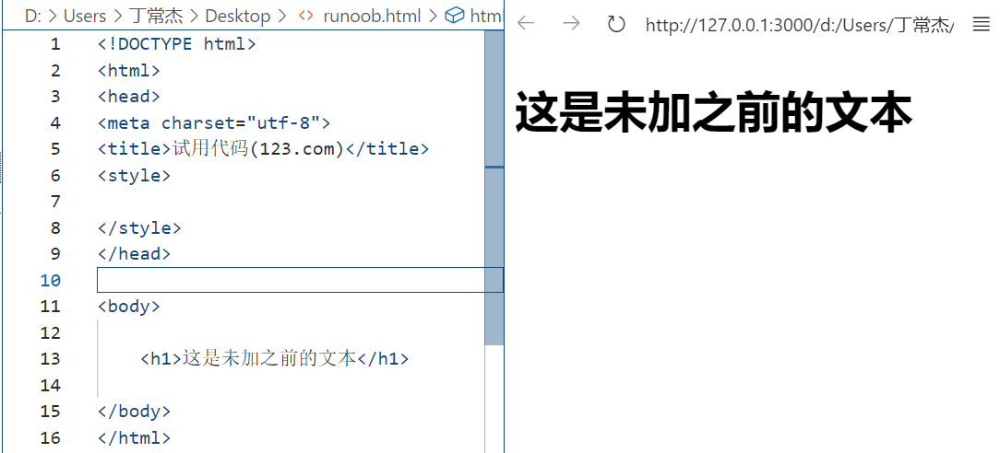
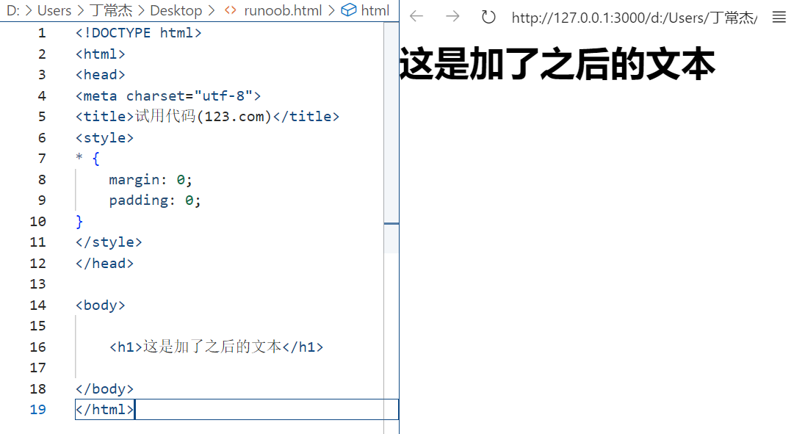
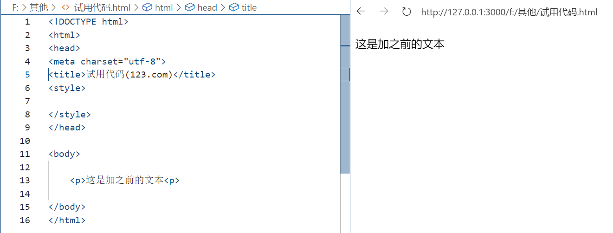
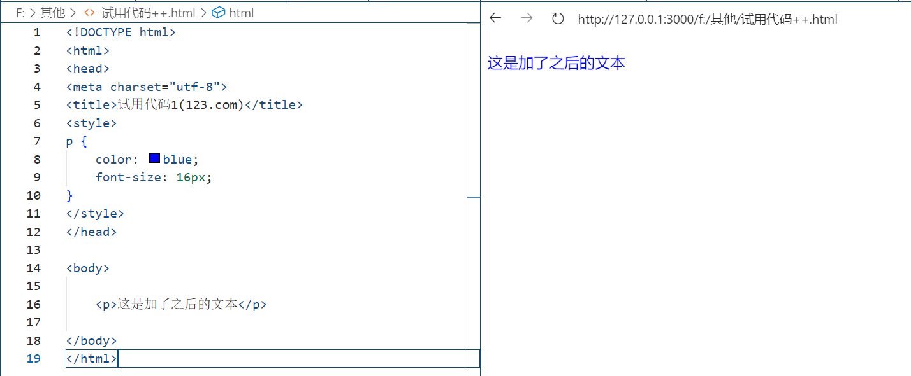
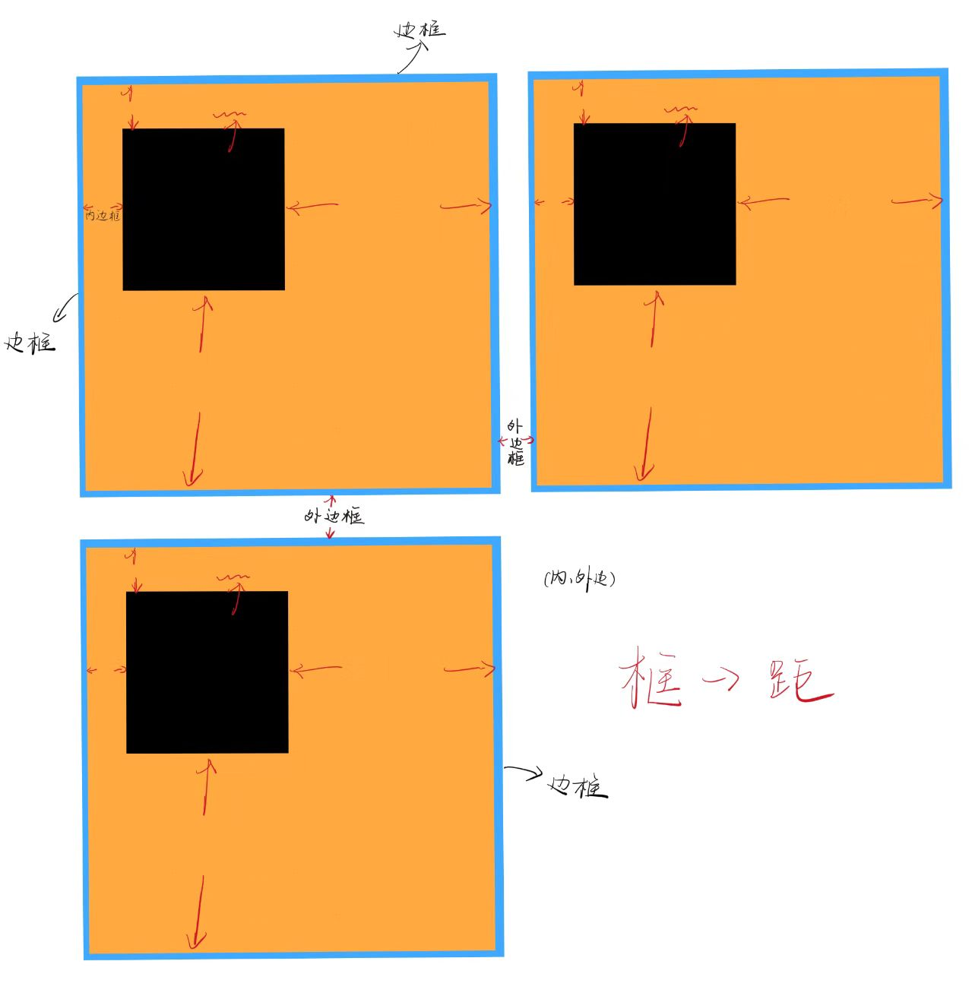

# CSS-学习笔记


## 零、学习 CSS 之前

* **CSS** (Cascading Style Sheets，层叠样式表）

* **CSS**是一种<u>用来为**结构化文档**（如 ==HTML 文档==或 XML 应用）**添加样式**（==字体、间距和颜色等==）的**计算机语言**</u>。
* **CSS** 文件扩展名为 **.css**
* 通过使用 **CSS** 可以大大提升网页开发的工作效率！ 
* **CSS**可以同时控制多重网页的样式和布局。

- ==样式定义==<u>**如何显示** HTML 元素</u>？
- 样式通常存储在**样式表**中
- 把样式添加到 HTML  **中**，是为了解决**内容与表现分离**的问题（**内部样式表**）
- **外部样式表**可以<u>极大提高工作效率</u>（**避免重复写代码，冗长无用**）
- ==外部样式表通常存储在 **CSS 文件**中==
- <u>多个样式定义可**层叠**为一个</u>[^1]


## 一、CSS 语法基础

### 1、CSS 语法规则

CSS 规则由两个主要的部分构成：**选择器，以及一条或多条声明**:


* 选择器通常是您需要改变样式的 HTML **元素**。

* **每条声明由一个属性和一个值组成**。

* 属性（property）是您希望设置的==样式属性==（style attribute）。
  * 每个属性有一个**值**
  * 属性和值**被冒号分开**（<u>每个属性一句声明</u>）

* CSS 声明总是以大括号`{}` 括起来，最终以分号 `;`结束:

```css
p {color:red;text-align:center;}
/*或*/
p {
    color:red;
    text-align:center;
}
```

### 2、CSS 注释

注释是用来解释你的代码，并且可以随意编辑它，浏览器会忽略它。

CSS注释以 `/*` 开始, 以 `*/` 结束,**（`//`不行）**
实例如下:

```css
/*这是个注释*/ 
p 
{
    text-align:center;    
    /*这是另一个注释*/    
    color:black;    
    font-family:arial;
}
```

### 3、CSS 属性

#### 0、一个小的注意点

`-`最好不要敲空格再去连接两个字符串（**会导致编译器无法识别该属性名**），即：

```css
{
    font - family:arial;
}
```

❌

```css
{
    font-family:arial;
}
```

⭕
**==属性内部是这样，选择器也是！！==**

如：

```css
.static - element
{
······
}
```

因为虽然在 CSS 选择器里，类名中间的连接符（比如`-`）和字符串之间可以有空格，但这可能会改变选择器的语义。

==**非良好的代码风格！！！**==

连字符（`-`）是类名的一部分，用于连接多个单词来构成一个有意义的类名，中间不能有空格。如果有空格，浏览器会将`.static`识别为一个类选择器，而`- element`会被认为是一个错误的语法部分。


**以下是按常用与否的顺序排列的CSS属性：**

#### 1、常用属性

| 属性                | 说明                                                 | CSS  |
| :------------------ | :--------------------------------------------------- | :--- |
| margin              | 设置元素的外边距                                     | 1    |
| padding             | 设置元素的内边距                                     | 1    |
| width               | 设置元素的宽度                                       | 1    |
| height              | 设置元素的高度                                       | 1    |
| display             | 规定元素应该生成的框的类型                           | 1    |
| position            | 规定元素的定位类型                                   | 2    |
| top                 | 设置定位元素的上外边距边界与其包含块上边界之间的偏移 | 2    |
| right               | 设置定位元素右外边距边界与其包含块右边界之间的偏移   | 2    |
| bottom              | 设置定位元素下外边距边界与其包含块下边界之间的偏移   | 2    |
| left                | 设置定位元素左外边距边界与其包含块左边界之间的偏移   | 2    |
| float               | 规定框是否应该浮动                                   | 1    |
| clear               | 规定元素的哪一侧不允许其他浮动元素                   | 1    |
| background-color    | 设置或检索对象的背景颜色                             | 1    |
| background-image    | 设置或检索对象的背景图像                             | 1    |
| background-repeat   | 设置或检索对象的背景图像如何铺排填充                 | 1    |
| background-position | 设置或检索对象的背景图像位置                         | 1    |
| border              | 设置对象边框的特性                                   | 1    |
| border-width        | 设置或检索对象的边框宽度                             | 1    |
| border-style        | 设置或检索对象的边框样式                             | 1    |
| border-color        | 设置或检索对象的边框颜色                             | 1    |
| color               | 设置文本的颜色                                       | 1    |
| font-family         | 规定文本的字体系列                                   | 1    |
| font-size           | 规定文本的字体尺寸                                   | 1    |
| text-align          | 规定文本的水平对齐方式                               | 1    |
| text-decoration     | 规定添加到文本的装饰效果                             | 1    |
| line-height         | 设置行高                                             | 1    |
| z-index             | 设置元素的堆叠顺序                                   | 2    |
| cursor              | 规定要显示的光标的类型（形状）                       | 2    |
| overflow            | 规定当内容溢出元素框时发生的事情                     | 2    |
| visibility          | 规定元素是否可见                                     | 2    |

#### 2、较常用属性

| 属性            | 说明                                                         | CSS  |
| :-------------- | :----------------------------------------------------------- | :--- |
| box-sizing      | 允许您为了适应区域以某种方式定义某些元素                     | 3    |
| border-radius   | 设置或检索对象使用圆角边框                                   | 3    |
| box-shadow      | 向方框添加一个或多个阴影                                     | 3    |
| transform       | 适用于2D或3D转换的元素                                       | 3    |
| transition      | 此属性是 transition-property、transition-duration、transition-timing-function、transition-delay 的简写形式 | 3    |
| animation       | 复合属性。检索或设置对象所应用的动画特效                     | 3    |
| flex            | 复合属性。设置或检索弹性盒模型对象的子元素如何分配空间       | 3    |
| justify-content | 设置或检索弹性盒子元素在主轴（横轴）方向上的对齐方式         | 3    |
| align-items     | 定义flex子项在flex容器的当前行的侧轴（纵轴）方向上的对齐方式 | 3    |
| align-content   | 在弹性容器内的各项没有占用交叉轴上所有可用的空间时对齐容器内的各项（垂直） | 3    |
| grid-column     | 设置网格元素列的开始和结束位置                               | 3    |
| grid-row        | 设置网格元素行的开始和结束位置                               | 3    |
| column-count    | 指定元素应该分为的列数                                       | 3    |
| column-gap      | 指定列之间的差距                                             | 3    |
| user-select     | 规定是否允许用户选中文本                                     | 3    |
| resize          | 定义元素是否可以改变大小                                     | 3    |

## **二、CSS 选择器**

### 1、通用选择器（`*`）

- **定义理解**：通用选择器会选择页面中的所有元素。
  <u>它就像是一个 “一网打尽” 的工具</u>，**用于对整个页面进行基本的样式重置或设置。**
- **示例代码**：

```css
* {
    margin: 0;
    padding: 0;
}
```

这段代码将页面中所有元素的外边距和内边距都设置为 0，用于清除浏览器默认的边距设置：





**很明显，边缘的边距缩小了！！！**

### 2、元素选择器（`标签名`）

- **定义理解**：元素选择器根据 **HTML 标签名**来选择元素。
  例如，`p`选择器会选中所有的`<p>`段落标签，`h1`选择器会选中所有的`<h1>`标题标签。
- **示例代码**：

```css
p {
    color: blue;
    font-size: 16px;
}
```

这会将页面中所有段落文本的颜色设置为蓝色，字体大小设置为 16 像素：





### 3、类选择器（`. 类名`）

- **定义理解**：
  * 类选择器用于选择具有**特定类名**的元素。
  * 在 HTML 中，可以<u>给多个不同的元素添加相同的类名，然后通过 CSS 类选择器统一设置它们的样式</u>。
  * 这就好比给一群不同的物品贴上相同的标签，然后根据这个标签来统一它们的外观。
- **示例代码**：
  在 HTML 中有`<div class="box"></div>`和`<p class="box"></p>`，在 CSS 中可以这样写：

```css
.box {
     border: 1px solid black;
     background-color: lightgray;
 }
```

这会给所有带有`box`类名的元素添加一个黑色边框和浅灰色的背景。

### 4、ID 选择器（`#ID 名`）

- **定义理解**： 

  * ID 选择器用于选择具有**特定 ID** 的元素。

  * 在 HTML 中，ID 应该是唯一的，就像每个人的身份证号码一样。

  * 它主要用于选择某个**特定的元素**进行特殊的样式设置。

    例如，在网页开发中，如果有一个元素的 ID 为 “myElement”，可以使用 “#myElement” 这样的 ID 选择器来对其应用特定的样式规则。

- **示例代码**：
  在 HTML 中有`<div id="header"></div>`，在 CSS 中可以这样写：

```css
#header {
    height: 100px;
    width: 100%;
    background-color: green;
}
```

这会将 ID 为`header`的元素高度设置为 100 像素，宽度设置为 100%，并且背景颜色为绿色。

### tips：选择器的选用

|      考虑因素      | 适用选择器 | 示例及解释                                                   |
| :----------------: | :--------: | :----------------------------------------------------------- |
|   **元素唯一性**   | ID 选择器  | 适用于页面中**唯一**的元素，<u>如唯一的页面头部</u>。 <br>#header {<br> height: 80px;<br> background-color: #333;<br> color: white;<br>}<br> |
|                    |  类选择器  | 多个元素需要**相同样式**时使用，<u>例如多个按钮</u>。 <br>.btn {<br> padding: 10px 20px;<br> border: none;<br> background-color: #007BFF;<br> color: white;<br> cursor: pointer;<br>}<br> |
|    **选择范围**    | 通用选择器 | 对页面上**所有元素**应用样式，<u>比如设置所有元素的盒模型</u>。 <br>* {<br> box-sizing: border-box;<br>}<br> |
|                    | 元素选择器 | 对**特定类型**的所有元素设置通用样式，<u>如设置所有段落的字体</u>。 <br>p {<br> font-family: Arial, sans-serif;<br>}<br> |
|     **特异性**     | ID 选择器  | **特异性最高**，<u>用于需要精确控制且**覆盖其他样式的情况**</u>。 <br>#special - text {<br> color: red;<br>}<br> |
|                    |  类选择器  | 特异性适中，可<u>灵活应用于多个元素</u>，**且能覆盖元素选择器样式**。 <br>.highlight {<br> background-color: yellow;<br>}<br> |
|                    | 元素选择器 | 特异性较低，适合设置<u>基本的通用样式</u>。 <br>h1 {<br> font-size: 2em;<br>}<br> |
|                    | 通用选择器 | 特异性最低，<u>通常用于设置全局基础样式</u>。 <br>* {<br> margin: 0;<br> padding: 0;<br>}<br> |
| **代码维护与复用** |  类选择器  | **可复用性高，便于维护和修改**，<u>例如多个地方的提示信息样式</u>。 <br>.info - msg {<br> color: blue;<br> font - size: 0.9em;<br>}<br> |
|                    | ID 选择器  | 由于唯一性，**不利于复用，主要用于特定元素的一次性样式设置。** |
|                    | 元素选择器 | 对同类型元素统一设置样式，**修改时影响所有该类型元素**，<u>复用性有限</u>。 |
|                    | 通用选择器 | 用于全局基础设置，<u>修改时影响整个页面元素</u>，**需谨慎使用**。 |


## **三、利用 CSS 设置元素的基础样式**

### 1、**大小设置**

#### **宽度和高度**

* 可以使用`width`和`height`属性来设置元素的宽度和高度。

* 这些属性的值可以是像素（px）、百分比（%）、em（相对单位，相对于元素的字体大小）等。

  例如，`width: 200px; height: 100px;`会将元素的宽度设置为 200 像素，高度设置为 100 像素。

#### **最大最小尺寸**

* `max-width`、`min-width`、`max-height`和`min-height`属性用于限制元素的最大和最小尺寸。
* 这在创建响应式布局时非常有用，
  例如`max-width: 600px;`会确保元素的宽度不会超过 600 像素。

### 2、**颜色设置**

#### **文本颜色**

* 使用`color`属性来设置文本的颜色。
* 颜色值可以是颜色名称（如`red`、`blue`）、十六进制值（如`#ff0000`表示红色）或者 RGB（A）值（如`rgb(255, 0, 0)`或`rgba(255, 0, 0, 0.5)`，最后一个参数是透明度）。

#### **背景颜色**

* `background-color`属性用于设置元素的背景颜色，使用方法和`color`属性类似。

### 3、**文字字体设置**

#### **字体族**

* `font-family`属性用于**指定文本的字体族**。
  可以设置多个字体名称作为备用，例如`font-family: Arial, sans-serif;`表示首先尝试使用 Arial 字体，<u>如果用户计算机上没有安装 Arial 字体，则使用默认的无衬线字体（sans - serif）</u>。

#### **字体大小**

* `font-size`属性用于设置字体的大小，
  如`font-size: 16px;`会将字体大小设置为 16 像素。

#### **字体样式和粗细**

* `font-style`属性可以设置字体为正常（`normal`）、斜体（`italic`）或倾斜（`oblique`）；
* `font - weight`属性可以设置字体的粗细，
  如`font-weight: bold;`会使字体加粗。


## **四、CSS 的盒模型**

### 1、**理论理解**

- CSS 盒模型描述了一个元素在页面中所占据的空间。
  它包括内容（content）、内边距（padding）、边框（border）和外边距（margin）。
  可以把一个元素想象成一个盒子，
  * 内容是盒子里面装的东西，
  * 内边距是内容与盒子边框之间的距离，
  * 边框是盒子的边缘，
  * 外边距是盒子与周围元素之间的距离。
- 盒模型有两种模式：标准盒模型和怪异盒模型（IE 盒模型）。
  * 标准盒模型中，元素的宽度和高度只包括内容部分；
  * 而在怪异盒模型中，元素的宽度和高度包括内容、内边距和边框。

### 2、**示例代码与实践**

- 假设我们有一个`<div>`元素，设置如下样式：

```css
div {
    width: 200px;
    height: 100px;
    padding: 20px;
    border: 5px solid black;
    margin: 30px;
}
```

- 这个`<div>`元素的内容区域
  **宽度**实际上是 200px，
  **高度**是 100px。

  但是<u>加上内边距、边框和外边距后，它在页面中实际占据</u>的
  **空间宽度**是`200 + 2*20（左右俩） + 2*5（左右俩） + 2*30（左右俩） = 310px`，*<下同>*
  **高度**是`100+ 2*20 + 2*5+ 2*30 = 210px`

  通过修改这些属性的值，观察元素在页面中的大小和位置变化，深入理解盒模型。

### 3、边距 外边距 边框的概念理解

* **内边距**是指元素内容与边框之间的距离，它会在元素内部增加空间，使内容不紧贴边框。
  例如，一个盒子模型中，内边距可以让盒子里的文字或图片与盒子的边缘保持一定的距离，看起来更加舒适。

* **外边距**是指元素与相邻元素之间的距离，它可以控制元素之间的间隔。
  比如，多个盒子排列时，通过调整外边距可以控制盒子之间的间距，使页面布局更加合理。

* **边框**是围绕元素内容的线条，可以设置不同的样式、宽度和颜色。边框明确界定了元素的范围，起到装饰和区分不同元素的作用。

大致如下手绘图（草了一点哈(*/ω＼*)）：

==每一个大框为一个盒子！！==


## **五、CSS 的 5 种常用 position 定位**+1种不常用 position 定位

### 1、静态定位（static）

- **定义理解**：

  * 这是元素的**默认定位方式**。
  * 在这种定位下，元素按照**文档流**[^2]的顺序依次排列，不受`top`、`bottom`、`left`、`right`属性的影响。

- **示例代码**：

```css
.static-element {
     position: static;
 }
```

一般情况下，<u>不需要特别为元素设置 `position: static`，因为这是默认状态</u>。

### 2、相对定位（relative）

- **定义理解**：

  * 相对定位的元素是**<u>相对于它自身原来在文档流中的位置</u>**进行定位的。
  * 当设置`top`、`bottom`、`left`、`right`属性时，**元素会从它原来的位置移动**，<u>但它原来占据的空间仍然保留在文档流中</u>。

- **示例代码**：

```css
.relative-element {
     position: relative;
     top: 20px;
     left: 30px;
 }
```

这个元素会相对于它原来的位置向下移动 20 像素，向右移动 30 像素，但它原来的空间还在，其他元素不会占据它原来的位置。

> *==“top”和“bottom”的区别==*
>
> ***“top”** 是指从元素原本的顶部位置开始计算偏移量。*
> *例如，在布局中设置一个元素距离另一个元素的 “top” 为一定数值时，就是从这个元素的顶部开始测量到另一个元素的距离。*
>
> ***“bottom”** 是从元素原本的底部位置开始计算偏移量。*
> *比如在页面布局中，当设置一个元素相对于另一个元素的 “bottom” 值时，是从该元素的底部开始测量到另一个元素的距离*

### 3、绝对定位（absolute）

- **定义理解**：
  * 绝对定位的元素是相对于它最近的**已定位**（非`static`）**祖先元素**进行定位的。
  * <u>如果没有已定位的祖先元素，那么它会相对于文档根元素</u>（`<html>`）进行定位。
  * 元素脱离文档流，原来占据的空间不再保留。
- **示例代码**：

```css
.parent-element {
     position: relative;
 }
.absolute-element {
     position: absolute;
     top: 50px;
     left: 50px;
 }
```

假设`.absolute-element`是`.parent-element`的子元素，那么`.absolute-element`会相对于`.parent-element`的左上角，向下移动 50 像素，向左移动 50 像素。

### 4、固定定位（fixed）

- **定义理解**：
  * 固定定位的元素是***相对于浏览器窗口进行定位的***。
  * 即使页面滚动，元素的位置也不会改变.
  * **常用于创建固定的导航栏、返回顶部按钮等。**
- **示例代码**：

```css
.fixed-element {
     position: fixed;
     top: 10px;
     right: 10px;
 }
```

这个元素会固定在浏览器窗口的右上角，距离顶部 10 像素，距离右侧 10 像素。

### 5、粘性定位（sticky）

- **定义理解**：
  * 粘性定位是相对定位和固定定位的混合。
  * 元素<u>在到达某个特定的滚动位置之前，会按照正常的文档流进行定位</u>.
  * **当滚动到这个位置后，它会固定在这个位置，直到页面继续滚动超过它的范围**。
- **示例代码**：

```css
.sticky-element {
     position: sticky;
     top: 0;
 }
```

**当页面滚动时，这个元素会在到达浏览器窗口顶部时固定在那里，就像固定定位一样，但在到达顶部之前，它是按照文档流正常排列的**。

### *6、**继承定位（inherit）**

* **概念：**
  * 它规定应该从父元素继承 `position` 属性的值。
  * 如果父元素有设置 `position`（非 `static`），子元素的 `position` 设置为 `inherit` 时，就会继承父元素的定位方式。
  * 例如，如果父元素是 `relative` 定位，子元素设置 `position: inherit`，那么子元素也会按照相对定位的规则来布局，并且其定位的参照对象和父元素相同。 

* **使用场景：**
  * 当你想要在一组元素中保持定位方式的一致性，并且不想重复定义相同的定位属性时，可以使用 `inherit`。
  * 比如，有一个包含多个子元素的容器，容器是相对定位的，其中一些子元素在某些情况下需要和容器保持相同的定位方式，就可以使用 `inherit`。
  * 不过在实际应用中，这种定位方式相对其他几种来说使用频率较低。

## **六、CSS 常用的布局方式**

### 1、**流式布局（Flow Layout）**

- **定义理解**：

  * 这是最基本的布局方式，元素按照文档流的顺序依次排列。
  * 块级元素会独占一行，行内元素会在一行内从左到右排列。

- **示例应用场景**：

  简单的文本段落和列表通常采用流式布局，如一篇文章中的段落，HTML 列表元素`<ul>`和`<ol>`中的列表项。

  > ***小结***
  >
  > * *在流式布局中，页面元素会根据浏览器窗口的大小自动调整位置和尺寸，以适应不同的屏幕分辨率和设备。*
  > * *这种布局方式通常使用相对单位（如百分比）来定义元素的宽度和高度，而不是固定的像素值。*
  > * *这样可以使页面在不同尺寸的屏幕上都能保持较好的可读性和可用性。*
  > * *例如，在一个流式布局的网页中，当用户调整浏览器窗口大小时，图片、文字和其他元素会自动调整大小和位置，以填满可用空间，而不会出现空白或重叠的情况。*

### 2、**浮动布局（Float Layout）**

- **定义理解**：

  * 通过设置`float`属性（`left`或`right`），可以使元素向左或向右浮动，从而脱离文档流，其他元素会环绕在它的周围。

  * **常用于创建多列布局**。

- **示例代码与应用场景**：

```css
.left-float {
     float: left;
     width: 50%;
 }
.right-float {
     float: right;
     width: 50%;
 }
```

在一个网页的主体部分，可以用这种方式创建左右两列的布局，用于显示不同的内容，如文章内容和侧边栏。

> ***小结***
>
> * *在浮动布局中，元素可以通过设置 “float” 属性，使其脱离文档流并向左或向右浮动。*
> * *例如，一个网页中有多个图片元素，可以使用浮动布局让它们在一行中依次排列，节省页面空间。*
> * *通过浮动布局，可以灵活地控制页面元素的位置和排列方式，以实现各种复杂的页面设计效果。*

### 3、弹性布局（Flex Layout）

- **定义理解**：

  * 通过设置`display: flex;`，可以使父元素成为一个弹性容器，子元素可以在这个容器中按照一定的规则进行排列。

  * **可以控制子元素的排列方向、对齐方式等**

- **示例代码与应用场景**：

```css
.flex-container {
     display: flex;
     justify-content: space - between;
     align-items: center;
 }
```

这会使`.flex-container`中的子元素在水平方向上两端对齐，并且在垂直方向上居中对齐。
**常用于导航栏、产品展示等布局**。

### 4、网格布局（Grid Layout）

- **定义理解**：

  * 网格布局将页面划分为行和列的网格，元素可以放置在这些网格单元中。

  * **可以精确地控制元素在网格中的位置和跨越的网格数量。**

- **示例代码与应用场景**：

```css
.grid-container {
     display: grid;
     grid-template-columns: repeat(3, 1fr);
     grid-template-rows: repeat(2, 100px);
 }
```

这会创建一个包含 3 列（每列宽度相等）和 2 行（每行高度为 100 像素）的网格容器，用于排列子元素。常用于创建复杂的网页布局，如页面的整体框架布局。


## **七、CSS 的伪类**

### 0、定义理解：

* 伪类用于向某些选择器添加特殊的效果。

* 它是基于元素的状态或位置来应用样式的，而不是基于元素的标签名、类名或 ID。
* 例如，`:hover`伪类会在鼠标悬停在元素上时应用样式。

- **示例代码与应用场景**：

### 1、**链接伪类**

```css
a {
    color: blue;
    text-decoration: none;
}
a:hover {
    color: red;
    text-decoration: underline;
}
```

这会使链接默认颜色为蓝色，没有下划线。当鼠标悬停在链接上时，颜色变为红色，并且添加下划线，提供了交互效果。

### **2、表单元素伪类**

```css
input:focus {
    border: 2px solid green;
}
```

当输入框获得焦点（用户点击输入框准备输入内容）时，边框会变为 2px 宽的绿色边框，用于增强用户对焦点状态的感知。


## *注释

[^1]: 在某些情况下，可以有**多个样式的定义**，这些**定义可以相互叠加**，<u>最终形成一个综合的样式效果</u>。例如在网页设计中，可能通过 CSS（层叠样式表）对一个元素进行多个样式规则的定义，这些规则**会按照一定的优先级进行层叠**，共同决定该元素最终呈现的样式。比如可以先定义一个元素的字体颜色为红色，又定义其字体大小为 14 像素，这两个样式定义就层叠在了一起作用于这个元素。
[^2]:文档流是一种**网页布局方式**，在默认情况下，网页中的元素会按照一定的规则在文档中排列，不脱离文档流的元素会按照其在 HTML 中的顺序依次显示，并且会受到其他元素的影响。<br>例如，块级元素会独占一行，内联元素会在一行内依次排列。不脱离文档流的元素会遵循正常的布局规则，如从上到下、从左到右的顺序进行布局。如果一个元素设置了浮动或定位等属性，它就可能脱离文档流，从而影响周围元素的布局。<br>简单来说，文档流就是网页中元素的默认布局方式，它决定了元素在页面中的位置和显示顺序。不脱离文档流意味着元素按照正常的布局规则进行排列，不会对其他元素的布局产生意外的影响。在网页设计中，了解文档流的概念对于合理布局页面元素非常重要。