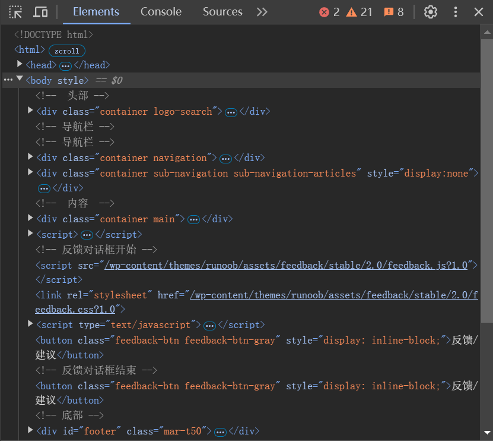
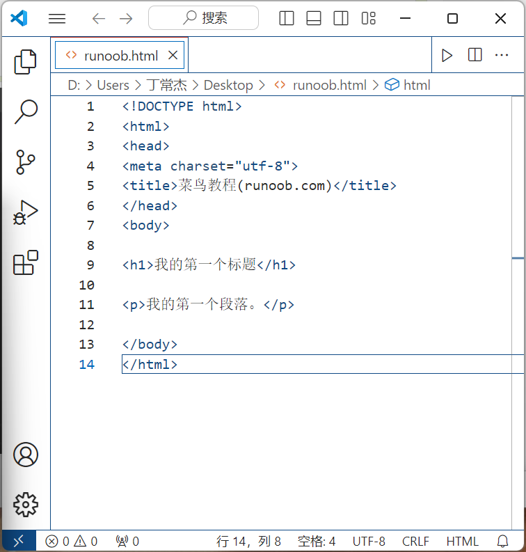
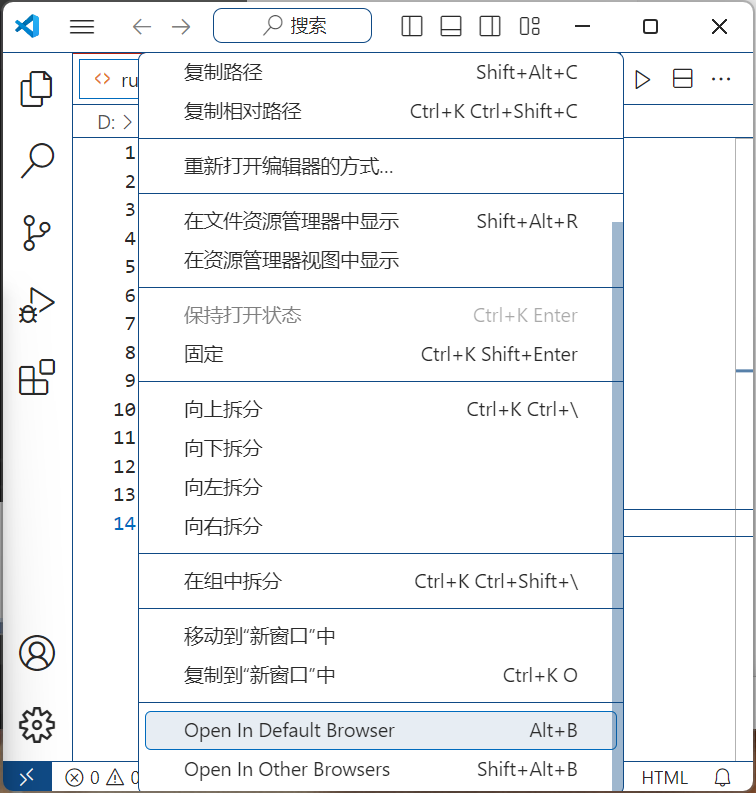
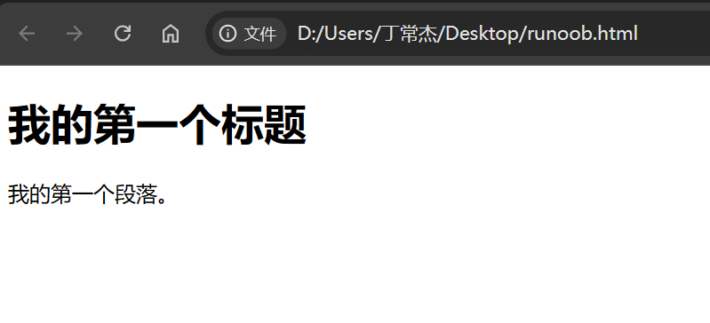
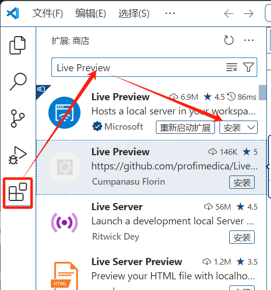
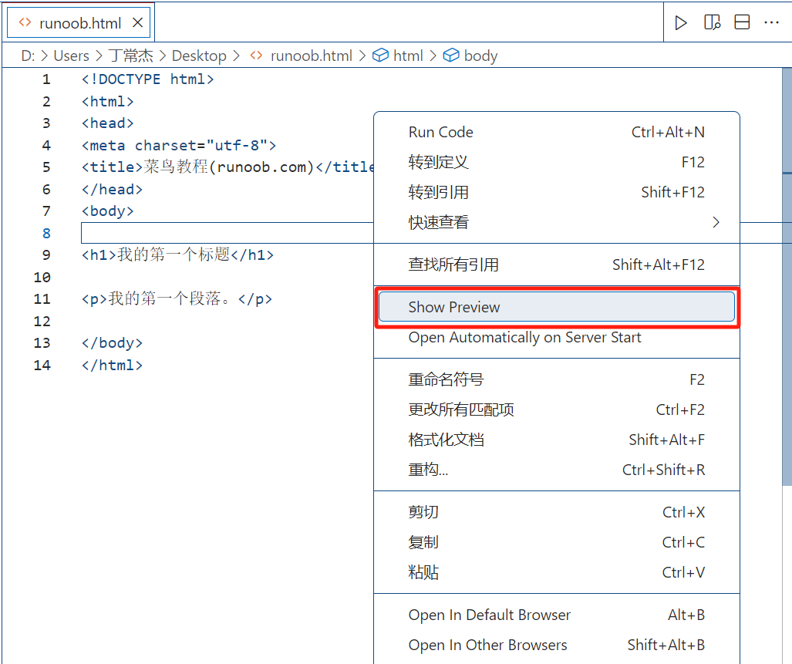
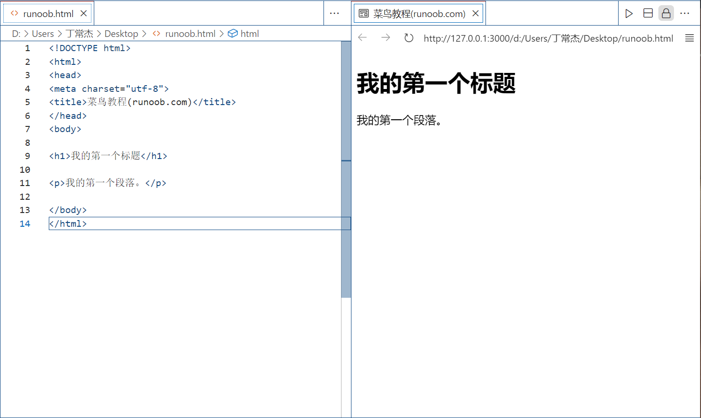
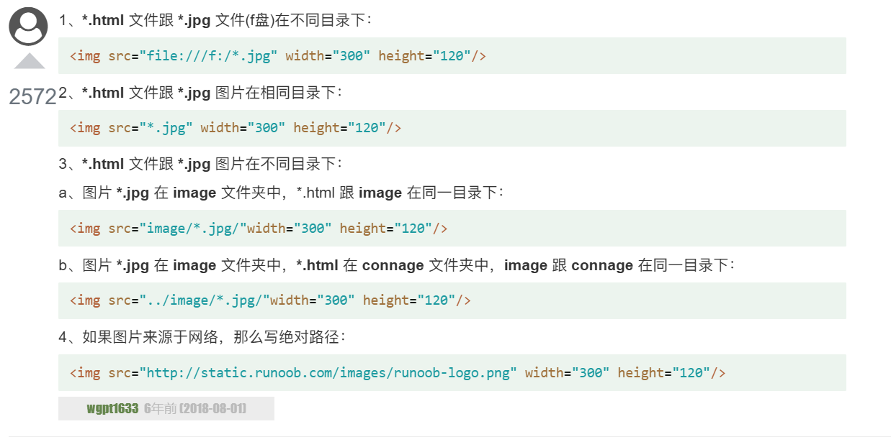
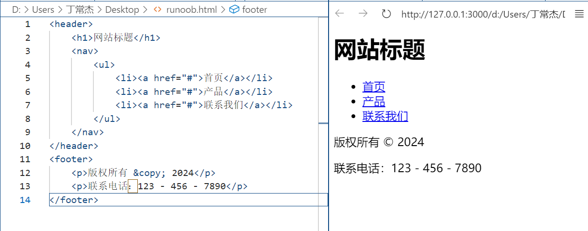
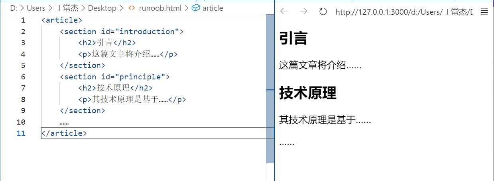

# HTML-学习笔记


* 超文本标记语言（**H**yper**T**ext **M**arkup **L**anguage，即HTML）
* 是一种用于创建网页的**标准标记语言**[^1]。
* <u>可以使用 HTML 来建立自己的 web 站点，HTML 运行在浏览器上，由浏览器来解析</u>。

## 零、HTML基本结构

### HTML 实例

```html
<!DOCTYPE html>
<html>
    <!-- 头部 -->
<head>
<meta charset="utf-8">   <!-- 使用 utf-8 编码 -->
<title>菜鸟教程(runoob.com)</title>
</head>
    <!-- body -->
<body>
 
<h1>我的第一个标题</h1>
 
<p>我的第一个段落。</p>
 
</body>
</html>
```

效果是这样的


### 基本骨架

* **`<!DOCTYPE html>`**为**声明**，声明为 ***HTML5*** 文档

* **`<html>`**元素是 HTML 页面的**根元素[^2]**

* **`<head>`**元素，名为”头“，包含了文档的**元数据**[^3]，如后面的**`<meta charset="utf-8">`**就是定义了网页的编码格式为 **utf-8**。

* **`<title>`**元素，顾名思义，描述了文档的标题 (在后面的**`<\title>`**表示标题的结束，即夹在俩元素中间的内容就是标题的内容)

* **`<body>`**元素包含的则是可见的页面内容，如上方的

  ```html
   
  <h1>我的第一个标题</h1>
   
  <p>我的第一个段落。</p>
  
  ```

  就是整个的页面内容

* **`<h1>`**元素定义了一个大标题(一级标题)，显然二级到六级标题也是一样的写法(**`<h2> <h3> ... <h6>`**)

* **`<p>`**元素则是定义的一个段落


**注：**在浏览器的页面上使用键盘上的 **F12(笔记本用 Fn+F12)** 按键开启**调试模式**[^4]，就可以看到组成标签：




## 一、初步了解 HTML

### 0、什么是 HTML

HTML 是用来**描述网页的一种语言**。

- HTML 指的是超文本标记语言: ==**H**yper**T**ext **M**arkup **L**anguage==
- <u>HTML 不是一种编程语言，而是一种**标记**语言</u>
- 标记语言是一套**标记标签** (markup tag)
- HTML 使用标记标签来**描述**网页
- HTML 文档包含了HTML **标签**及**文本**内容
- HTML文档也叫做 **web 页面**

### 1、HTML 标签

HTML 标记标签通常被称为 HTML 标签 (HTML tag)。

- HTML 标签是由 *尖括号* 包围的关键词，比如 `<html>`

- HTML 标签通常是 *成对出现* 的，比如 `<b>`和 `</b>`

- 标签对中的第一个标签是 *开始标签* ，第二个标签是*结束标签*

- 开始和结束标签也被称为 *开放标签*  和 *闭合标签*

  ```html
  <标签>内容</标签>
  ```

### 2、HTML 元素

"HTML 标签" 和 "HTML 元素" 通常都是描述同样的意思.

但是严格来讲, <u>一个 HTML 元素包含了开始标签与结束标签</u>，如下实例:

HTML 元素:

```html
<p>这是一个段落。</p>
```

```html
<title>这是一个文档标题。</title>
```

```html
<h1>这是一级标题。</h1>
```

### 3、Web 浏览器

Web 浏览器是一种**用于访问互联网上的网页和其他在线资源的软件应用程序**。它可以<u>通过输入网址或点击链接来加载和显示网页内容</u>（<u>用于**读取HTML文件**，并将其**作为网页显示**</u>），包括文本、图像、视频等。常见的 Web 浏览器有谷歌浏览器、火狐浏览器、微软 Edge 浏览器等。用户可以使用 Web 浏览器进行搜索信息、阅读新闻、观看视频、进行在线购物等各种活动。

浏览器并不是直接显示的HTML标签，但可以<u>使用标签**来决定如何展现**HTML页面的内容</u>给用户：


------

### 4、HTML 网页结构

```HTML
<html>

    <head>

        <title>页面标题</title>

    </head>

    <body>

        <h1>这是一个标题</h1>

        <p>这是一个段落。</p>

        <p>这是另外一个段落。</p>

    </body>

</html>
```

下面是一个可视化的HTML页面结构：


### 5、<!DOCTYPE> 声明

`<!DOCTYPE>声明`有助于浏览器中正确显示网页。

网络上有很多不同的文件，如果能够正确声明HTML的版本，浏览器就能正确显示网页内容。

doctype 声明是**不区分大小写**的，以下方式均可：

```html
<!DOCTYPE html>

<!DOCTYPE HTML>

<!doctype html>

<!Doctype Html>
```


### 6、通用声明

#### HTML5（现常用）

```HTML5
<!DOCTYPE html>
```

#### HTML 4.01

```HTML 4.01
<!DOCTYPE HTML PUBLIC "-//W3C//DTD HTML 4.01 Transitional//EN"
"http://www.w3.org/TR/html4/loose.dtd">
```

#### XHTML 1.0

```XHTML 1.0
<!DOCTYPE html PUBLIC "-//W3C//DTD XHTML 1.0 Transitional//EN"
"http://www.w3.org/TR/xhtml1/DTD/xhtml1-transitional.dtd">
```

### 7、中文编码

目前在大部分浏览器中，直接输出中文会出现中文乱码的情况，这时候我们就需要在头部将字符声明为 UTF-8 或 GBK（常用 utf-8 ）。

```html
<head>
<meta charset="utf-8">
```

或

```html
<head>
<meta charset="gbk">
```

### 8、小tips

在HTML文档中，`<meta charset="utf-8">`和`<meta charset="utf-8"/>`都用于指定文档的字符编码，但它们之间有一个细微的差别：

1. **`<meta charset="utf-8">`**：
   - 这是标准的写法，用于告诉浏览器文档使用的是UTF-8编码。
   - UTF-8是一种广泛使用的字符编码，它可以表示几乎所有世界上的字符，并且与ASCII编码兼容。
   
2. **`<meta charset="utf-8"/>`**：
   - 这种写法在`charset`值后面包含了一个斜杠（`/`），**这是 XHTML 的语法**。
   - <u>在XHTML中，所有的元素都必须被正确地关闭</u>，包括空元素。
   - *在HTML5中，这种写法也是被接受的，但它不是必需的。*

实际上，对于HTML5文档来说，这两种写法在功能上是等效的，浏览器都会正确地解析并识别UTF-8编码。然而，从兼容性和标准性的角度来看，推荐使用第一种写法（`<meta charset="utf-8">`），因为它更符合HTML5的规范，并且在所有浏览器中都有良好的支持。

总结来说，两者的主要区别在于语法上，

`<meta charset="utf-8"/>`是**自闭合标签**的写法；

而`<meta charset="utf-8">`是**开放标签**的写法。

在实际使用中，选择其中一种即可，但`<meta charset="utf-8">`更为常见和推荐。


## 二、使用 VS Code 进行 HTML 的编译

### 0、编译 HTML 编译器推荐

可以使用专业的 HTML 编辑器来编辑 HTML，几款常用的编辑器：

- [VS Code](https://code.visualstudio.com/ "https://code.visualstudio.com/")
- [Sublime Text](http://www.sublimetext.com / "https://www.sublimetext.com/")
- [在线编辑器](https://www.jyshare.com/front-end/61/ "https://www.jyshare.com/front-end/61/")

### 1、使用 VS Code 工具来创建 HTML 文件

#### 步骤 1: 新建 HTML 文件

在 VS Code 安装完成后，选择" 文件(F)->新建文件(N) "，在新建的文件中输入以下代码：

```html
<!DOCTYPE html>
<html>
<head>
<meta charset="utf-8">
<title>菜鸟教程(runoob.com)</title>
</head>
<body>
 
<h1>我的第一个标题</h1>
 
<p>我的第一个段落。</p>
 
</body>
</html>
```



#### 步骤 2: 另存为 HTML 文件

然后选择" 文件(F)->另存为(A) "，文件名为 runoob.html；

保存 HTML 文件时，既可以使用 **.htm** 也可以使用 **.html** 扩展名。两者没有区别，完全根据个人的喜好，建议统一用 **.html**。

在一个容易记忆的文件夹中保存这个文件。

#### 步骤 3: 在浏览器中运行这个 HTML 文件

然后鼠标右击编辑器上的文件名，选择在默认浏览器打开（也可以其他的浏览器）:



> ==**注：**vscode 中使用浏览器打开 html 文件需要 安装 **"open in browser"** 扩展。==

运行显示结果类似如下:




### 2、使用 **VS Code** 安装 **Live Preview** 插件来实时预览编写的代码

>==：==
>
>
>
>==在编辑窗口右击鼠标，选择 **Show Preview** 选项：==
>
>
>
>==显示结果：==
>
>
>
>==这样我们就可以在编辑代码过程中实时预览到效果了。==

## 三、HTML 构成基础

### 1、HTML 标题

HTML 标题（Heading）是通过`<h1> `~ `<h6>`标签来定义的。

```html
<h1>一级标题喔~</h1>
<h2>二级标题耶！</h2>
<h3>三级标题嘞</h3>
```


### 2、HTML 段落

HTML 段落是通过标签`<p>`来定义的。

```html
<p>这是一个段落。</p>
<p>这还是一个段落喔😃</p>
```


### 3、HTML 链接

HTML 链接是通过标签`<a>`来定义的。

```html
<a href="https://github.com/rgfdhkh">https://github.com/rgfdhkh</a>
```

**tip:**在 href 属性[^5]中指定链接的地址。


### 4、HTML 图像

HTML 图像是通过标签``来定义的。

```html

```

**tip：** 图像的名称和尺寸是以属性的形式提供的。


(个人从本地的图片进行定义显示未成功，**显示为空白图片，可能是由于图片位置的信息对于未选择打开文件夹的 VS Code 是无法检索到的？🤔**)

**💡巧了，在下面讨论区找到了一些解决方法**

但是在我的 VS Code 中，我只是在试预览 HTML 的效果，并未打开某个文件夹，所以没能成功显示图片

****




### 5、HTML 水平线

`<hr> `标签在 HTML 页面中创建水平线。

hr 元素可用于分隔内容。

```html
<p>这是一个段落。</p> 
<hr>
<p>这是一个段落。</p>
<hr> 
<p>这是一个段落。</p>
```

<p>这是一个段落。</p> 
<hr>
<p>这是一个段落。</p>
<hr> 
<p>这是一个段落。</p>

### 6、HTML 注释

可以将注释插入 HTML 代码中，这样可以提高其可读性，使代码更易被人理解。浏览器会忽略注释，也不会显示它们。

注释写法如下:

```html
<!-- 这是一个注释 -->
```


**注释:** 开始括号之后（左边的括号）需要紧跟一个叹号 **!** (英文标点符号)，结束括号之前（右边的括号）不需要，合理地使用注释可以对未来的代码编辑工作产生帮助。


## 四、HTML 元素

- HTML 元素以**开始标签**（**起始标签（opening tag）**）起始
- HTML 元素以**结束标签**（**闭合标签（closing tag）**）终止
- **元素的内容**是开始标签与结束标签之间的内容
- 某些 HTML 元素具有**空内容（empty content）**
- 空元素**在开始标签中进行关闭**（以开始标签的结束而结束）
- 大多数 HTML 元素可拥有**属性**[^6]

我们所在写的 HTML 文档由 HTML 元素定义，我们之前了解到一些 HTML 的元素，而 HTML 中的元素到底有哪些呢?

### 1、**文本相关元素**

- **标题元素**（`<h1>` - `<h6>`）

  - 用于定义文档中的标题级别。`<h1>`是最高级别的标题，通常用于表示页面的主标题，`<h6>`是最低级别的标题。例如，在一篇新闻文章页面中，`<h1>`可以是新闻的主题，如 “重大科技突破：量子计算机新进展”，`<h2>`可能用于文章的各个章节标题，像 “量子计算机的原理介绍” 等。

- **段落元素**（`<p>`）

  - 用来定义一段文本内容。

    ```html
    "<p>这是一段关于 HTML 元素介绍的文字，它可以包含很多句子来阐述一个主题。</p>"。
    ```

    也就是说在`<p>`和`</p>`之间的所有内容（包括文字、字符等）都是会以段落文字的形式表现。

- **换行元素**（`<br>`）

  - 是一个空标签，用于强制换行。

    如果在一首诗的 HTML 展示中：

    ```html
    "<p>床前明月光，<br>疑是地上霜。</p>" 
    ```

    就能让诗句在 “光” 字后面的”，“换行显示：

    

- **文本格式化元素**

  - **加粗元素（`<b>`）和强调元素（`<strong>`）**：`<b>`只是简单地将文本加粗显示，而`<strong>`在语义上表示强调内容，**大多数浏览器对它们的默认样式都是加粗文本**，<u>但在搜索引擎优化（SEO）[^7]等场景下语义有差别</u>。例如:

    ```html
    “<p>这个单词很<b>重要</b>，但是这个单词是<strong>关键</strong>。</p>”。
    ```

    

  - **斜体元素（`<i>`）和引用元素（`<em>`）**：`<i>`标签用于定义斜体文本，它会使被包裹的内容以斜体的样式显示。`<em>`标签用于表示强调的文本，通常也以斜体的样式显示。**虽然在外观上二者表现相似，但它们的语义略有不同**。<u>`<em>`强调的是内容的重要性或特殊性，而`<i>`更多地是单纯地使文本呈现斜体外观</u>。比如:

    ```html
    “<p>他说话带着一种<i> 奇怪 </i>的语气，尤其是在说到<em> 重点 </em>部分。</p>”。
    ```

    

    **💡😎☝️tips:**由于文字在转换为斜体后，会有一定的字符重合现象，为了美观，我们可以在字符前后敲空格喔~

### 2、**链接相关元素**

- **锚元素**（`<a>`）

  - 用于创建超链接，可以链接到其他网页、同一网页的其他位置、文件等。

    例如:

    ```html
    “<a href="https://www.example.com">访问示例网站(这里必须要放字！不然就空了！！)</a>”
    ```

    显示出来即是  

    “<a href="https://www.example.com">访问示例网站</a>”

    用户点击“访问示例网站” 这部分文本（在网址中是可以直接点击跳转的，但是在typora中则需要Ctrl+点击），就会跳转到 “[https://www.example.com](https://www.example.com/)” 这个网址。

    它还有其他属性，如`target`属性[^8]**可以指定链接在何处打开**，如：

    ```HTML
    “<a href="https://www.example.com" target="_blank">在新窗口访问示例网站</a>” 
    ```

    会在新的浏览器窗口或标签页打开链接。

> [!NOTE]
>
> **对于`target`属性可以去设置的一些值：**
>
>   1、在 HTML 的`<a>`标签（超链接）中
>
>   - `_self`（默认值）
>     - 含义：在当前窗口或框架中加载链接的文档。例如，`<a href="https://example.com" target="_self">点击我</a>`，当用户点击这个链接时，链接指向的页面会在当前浏览器窗口中加载，替换掉当前显示的页面内容。
>   - `_blank`
>     - 含义：在新的浏览器窗口或标签页中加载链接的文档。这是比较常用的一个值，比如`<a href="https://newpage.com" target="_blank">打开新页面</a>`，点击链接后，浏览器会打开一个新的窗口或者标签页来显示链接指向的内容，这样用户可以在新的页面浏览内容的同时，保持原始页面仍然打开，方便用户返回。
>   - `_parent`
>     - 含义：在父框架集中加载链接的文档。这个值在使用框架（frameset）的网页结构中比较有用。如果页面是嵌套在其他框架中的子框架，使用`_parent`会使链接在包含该子框架的父框架中加载。不过由于框架在现代网页设计中使用较少，这个属性值的应用场景也相对有限。
>   - `_top`
>     - 含义：在整个浏览器窗口中加载链接的文档，会跳出所有的框架结构。如果网页包含多层嵌套框架，`_top`会使链接在最外层的浏览器窗口加载，忽略所有的内部框架，确保链接内容以最大的展示空间显示。
>
>   2、在 HTML 的`<form>`标签（表单）中
>
>   - `_self`（默认值）
>     - 含义：表单提交后，在当前窗口或框架中加载响应页面。例如，当用户在一个登录表单中填写信息并提交后，如果表单的`target`属性为`_self`，那么登录成功或失败后的响应页面会在当前窗口中显示。
>   - `_blank`
>     - 含义：表单提交后，在新的浏览器窗口或标签页中加载响应页面。这对于一些需要同时查看表单提交前后两个页面状态的情况比较有用，比如提交一个订单表单后，在新窗口中打开订单确认页面，用户可以方便地在新窗口查看订单详情，同时原始页面还可以用于其他操作。
>

### 3、列表元素

- **无序列表元素**（`<ul>`）和**列表项元素**（`<li>`）
  - `<ul>`用于定义<u>无序**列表**</u>，`<li>`用于定义列表中的**每个项目**。例如：

```html
<ul>
    <li>苹果</li>
    <li>香蕉</li>
    <li>橙子</li>
</ul>
```

会显示为一个以项目符号开头的水果列表

即：

<ul>
    <li>苹果</li>
    <li>香蕉</li>
    <li>橙子</li>
</ul>


- **有序列表元素**（`<ol>`）和**列表项元素**（`<li>`）
  - `<ol>`用于定义<u>有序**列表**</u>，列表项会按照数字或字母等顺序编号。例如：

```html
<ol>
    <li>第一步</li>
    <li>第二步</li>
    <li>第三步</li>
</ol>
```

会显示为一个有步骤顺序的列表

即：

<ol>
    <li>第一步</li>
    <li>第二步</li>
    <li>第三步</li>
</ol>


基于以上基础我们可以嵌套使用`<ol>` `<ul>` `<li>`这些来进行更复杂、更高效的列表显示

例：

<ul>
    第一件事
<ol>
    <li>第一步</li>
    <li>第二步</li>
    <ul>
        <li>第一小步</li>
        <ul>
            再一小步<br>......
            <ul>
            再一小步<br>......
        </ul>
        </ul>
        <li>第二小步</li>
    </ul>
    <li>第三步</li>
</ol>
</ul>
<ul>
    第二件事<br>......
</ul>
<ul>
    第三件事<br>......
</ul>


### 4、**图像元素（``）**

- 用于在网页中嵌入图像。它有`src`（s ! r ! c ! 不要敲错了！！！）属性用于<u>指定图像的来源路径</u>

- ==`alt`属性用于**在图像无法显示时提供替代文本描述**==

- `width`和`height`属性可以<u>设置图像的尺寸</u>。
  例如：
  
  ```HTML
  
  ```
  
  
  
  这会在网页中显示一张宽度为 300 像素、高度为 200 像素的风景图片
  **但是**当图片无法加载（图片已损毁或图片地址出现问题）时会显示 “一张美丽的风景图” 的文字描述：
  
  

### 5、表格元素

- **表格**元素（`<table>`）、**行**元素（`<tr>`）、**表头**元素（`<th>`）和**单元格**元素（`<td>`）
  - `<table>`用于定义表格的整体结构，`<tr>`用于定义表格中的行，`<th>`用于定义表头单元格（通常是表格列的标题），`<td>`用于定义普通单元格。例如：

```html
<table>
    <tr>
        <th>姓名</th>
        <th>年龄</th>
    </tr>
    <tr>
        <td>张三</td>
        <td>20</td>
    </tr>
</table>
```

会显示一个简单的包含姓名和年龄两列的表格。

<table>
    <tr>
        <th>姓名</th>
        <th>年龄</th>
    </tr>
    <tr>
        <td>张三</td>
        <td>20</td>
    </tr>
</table>


### 6、**表单元素**

- 表单元素（`<form>`）、输入元素（`<input>`）、标签元素（`<label>`）和按钮元素（`<button>`）

  - `<form>`用于**定义表单区域，用于收集用户信息**。

  - `<input>`是最常用的**表单输入字段**，可以根据`type`属性的不同，用于接收文本（`type="text"`）、密码（`type="password"`）、单选按钮（`type="radio"`）等多种类型的输入。

  - `<label>`用于为表单元素<u>提供标签说明，提高可用性</u>。

  - `<button>`用于**创建按钮**，<u>用户可以点击执行操作，如提交表单</u>。

    例如：

```html
<form>
    <label for="username">用户名：</label>
    <input type="text" id="username">
    <button type="submit">提交</button>
</form>
```

这是一个简单的包含**用户名输入框**和**提交按钮**的表单：

<form>
    <label for="username">用户名：</label>
    <input type="text" id="username">
    <button type="submit">提交</button>
</form>


## 五、HTML 属性

属性是 HTML 元素提供的附加信息。是用来<u>为 HTML 元素提供更多的信息或特定的设置</u>。例如，``中的“src”就是``元素的一个属性，它指定了要显示的图像的路径。属性可以控制元素的外观、行为等方面。

属性总是以 **name="value"** 的形式写在标签内，**name** 是属性的名称，**value** 是属性的值。

- HTML 元素可以设置**属性**
- 属性可以在元素中添加**附加信息**
- 属性一般描述于**开始标签**
- 属性总是以**名称/值对**的形式出现，**比如：name="value"**。

------

### 1、属性实例

HTML 链接由 `<a> `标签定义。链接的地址在 **href 属性**中指定：

```html
<a href="http://www.runoob.com">这是一个链接</a>
```

### 2、HTML 属性常用引用属性值

==属性值应该始终被包括在引号内。==

<u>双引号是最常用的，不过使用单引号也没有问题</u>。

> 💡**提示:** 在某些个别的情况下，比如属性值本身就含有双引号，那么您必须使用单引号（**单引号套双引号！！！**），例如：
>
> ```css
> name='John "ShotGun" Nelson'
> ```

------

### 3、tips

#### 1、HTML 提示：使用小写属性

属性和属性值对大小写不敏感。

不过，万维网联盟在其 HTML 4 推荐标准中推荐小写的属性/属性值。

而新版本的 (X)HTML 要求使用小写属性。

------

#### 2、HTML 属性参考手册

查看完整的HTML属性列表: [HTML 标签参考手册](https://www.runoob.com/tags/html-reference.html)。

下面列出了适用于大多数 HTML 元素的属性：

| 属性  | 描述                                                         |
| :---- | :----------------------------------------------------------- |
| class | 为html元素定义一个或多个类名（classname）(类名从样式文件引入) |
| id    | 定义元素的唯一id                                             |
| style | 规定元素的行内样式（inline style）                           |
| title | 描述了元素的额外信息 (作为工具条使用)                        |

1. **`id`**: 给元素一个唯一的标识符，可以用于 CSS 选择器或 JavaScript 操作。

   ```
   <div id="header">This is a header</div>
   ```

2. **`class`**: 给元素指定一个或多个类名，方便通过 CSS 或 JavaScript 操作。

   ```
   <p class="text-muted">This is a paragraph.</p>
   ```

3. **`style`**: 直接为元素定义 CSS 样式。

   ```
   <span style="color: red;">This text is red.</span>
   ```

4. **`href`**: 用于 `<a>` 标签，指定链接目标。

   ```
   <a href="https://www.example.com">Visit Example</a>
   ```

5. **`src`**: 用于 `` 和 `<script>` 标签，指定资源的路径。

   ```
   
   ```

6. **`alt`**: 用于 `` 标签，提供图片的替代文本。

   ```
   
   ```

7. **`title`**: 提供关于元素的额外信息，通常在鼠标悬停时显示。

   ```
   <button title="Click me">Submit</button>
   ```

8. **`name`**: 在 `<input>`, `<form>`, `<select>` 等表单元素中使用，定义元素的名称。

   ```
   <input type="text" name="username">
   ```

9. **`value`**: 定义表单元素的值。

   ```
   <input type="text" value="Default text">
   ```

10. **`target`**: 用于 `<a>` 标签，指定链接的打开方式（如 `_blank` 在新窗口中打开）。

    ```
    <a href="https://www.example.com" target="_blank" rel="noopener">Open in new tab</a>
    ```

11. **`type`**: 指定表单元素的类型（如 `text`, `password`, `submit`）。

    ```
    <input type="password" name="password">
    ```

12. **`placeholder`**: 为 `<input>` 和 `<textarea>` 提供一个占位符文本。

    ```
    <input type="text" placeholder="Enter your name">
    ```


## 六、HTML 区块

### 0、内容块是什么？

内容块可以是网页中具有特定功能或承载<u>**特定类型**信息</u>的部分，比如一个包含文本、图片的区域，或者一个用于展示特定数据的模块等。

### 1、HTML 区块是什么？

####       1、定义，作用，包含内容

* HTML 区块是指在 HTML 文档中<u>具有特定**结构和功能**</u>的**区域**。

* 通常可以包括各种 HTML 标签组合形成的内容块，比如 *段落、标题、列表* 等。

* 它是网页布局和内容组织的**基本单元之一**。

* 在 HTML 中，<u>不同的区块可以有不同的样式和属性设置</u>，以满足网页设计的需求。


####      2、HTML 区块有哪些常见的应用场景？

##### 1、页面布局划分

- **多栏布局**：使用 HTML 区块可以轻松地创建多栏式的网页布局。
  例如，一个典型的博客页面可能会有一个侧边栏用于显示分类目录、热门文章等信息，以及一个主要内容区域用于展示文章正文。可以通过`<div>`标签来划分这两个区域，像下面这样的简单代码：
  
  ```html
  <div id="sidebar">
      <ul>
          <li><a href="#">分类1</a></li>
          <li><a href="#">分类2</a></li>
      </ul>
  </div>
  <div id="main-content">
      <p>这是文章正文内容……</p>
  </div>
  ```
  
  
  
  - **头部和底部布局**：网页的头部（header）和底部（footer）也是常见的区块应用场景。头部通常包含网站的标志、导航菜单等元素，底部可能有版权信息、联系方式等。
  
  ```html
  <header>
      <h1>网站标题</h1>
      <nav>
          <ul>
              <li><a href="#">首页</a></li>
              <li><a href="#">产品</a></li>
              <li><a href="#">联系我们</a></li>
          </ul>
      </nav>
  </header>
  		<!-脚页-!>
  <footer>
      <p>版权所有 &copy; 2024</p>
      <p>联系电话：123 - 456 - 7890</p>
  </footer>
  ```
  
  

> [!NOTE]
>
> ##### 补充：`href="#"`意义作用
>
> **功能作用**
>
> - **跳转到页面顶部**：当用户点击带有 `href="#"` 的链接时，浏览器会将页面滚动到当前页面的顶部。这是因为 `#` 本身是一个锚点标识符，当没有指定具体的锚点名称时，浏览器默认将其解释为页面顶部。
> - **作为占位符**：在某些情况下，开发者可能希望创建一个看起来像链接的元素，但暂时不想让它跳转到任何特定的页面或位置。这时可以使用 `href="#"` 来实现，它可以让 `<a>` 标签呈现出链接的样式，同时又不会产生实际的页面跳转或刷新。
>
> **使用场景**
>
> - **导航菜单**：在网站的导航菜单中，有时会使用 `href="#"` 作为链接，以便在用户点击菜单项时，通过 JavaScript 来触发相应的功能，如展开子菜单、显示隐藏内容等，而不是进行页面跳转。
> - **JavaScript 触发**：当需要通过点击链接来触发 JavaScript 函数时，`href="#"` 可以与 `onclick` 事件配合使用。例如 `<a href="#" onclick="functionName()">点击这里</a>`，这样在点击链接时会执行指定的 JavaScript 函数。不过，这种方式需要注意在函数内部阻止默认的链接行为，否则页面会滚动到顶部8。
>
> **与其他属性值对比**
>
> - **与 `href=""` 对比**：`href=""` 也表示链接到当前页面，但它会导致页面刷新，而 `href="#"` 不会刷新页面，只是滚动到顶部2。
> - **与 `href="javascript:;"` 对比**：`href="javascript:;"` 也可以用于创建一个不会进行页面跳转的链接，它的作用是执行空的 JavaScript 代码，从而避免点击链接时产生任何默认行为。与 `href="#"` 相比，`href="javascript:;"` 更明确地表示不进行任何页面导航，并且在某些情况下可能具有更好的兼容性和可维护性2。
>
> 不过，在使用 `href="#"` 时也存在一些注意事项。如果在使用 `href="#"` 的同时，JavaScript 代码出现错误或被禁用，那么点击链接时仍然会跳转到页面顶部，可能会影响用户体验。
> 因此，在实际应用中，建议根据具体需求谨慎使用，并结合 JavaScript 的错误处理和兼容性考虑来确保页面的正常功能。

##### 2、内容分组与管理

- **文章内容分组**：在长文章中，为了使内容结构更清晰，可以使用 HTML 区块对内容进行分组。例如，将一篇科技文章分为引言、技术原理、应用案例、结论等几个部分，每个部分可以放在一个单独的`<section>`标签中。

  ```html
  <article>
      <section id="introduction">
          <h2>引言</h2>
          <p>这篇文章将介绍……</p>
      </section>
      <section id="principle">
          <h2>技术原理</h2>
          <p>其技术原理是基于……</p>
      </section>
      ……
  </article>
  ```

  

  - **表单元素分组**：当网页中有表单时，使用 HTML 区块可以将相关的表单字段分组，提高表单的可读性和可用性。例如，一个用户注册表单可能会将个人信息（姓名、性别、生日等）和账户信息（用户名、密码等）分为不同的组。

  ```html
  <form>
      <fieldset>
          <legend>个人信息</legend>
          <label for="name">姓名：</label><input type="text" id="name">
          <label for="gender">性别：</label><input type="text" id="gender">
          <label for="birthday">生日：</label><input type="date" id="birthday">
      </fieldset>
      <fieldset>
          <legend>账户信息</legend>
          <label for="username">用户名：</label><input type="text" id="username">
          <label for="password">密码：</label><input type="password" id="password">
      </fieldset>
  </form>
  ```

  

##### 3、实现动态效果

- **JavaScript 交互**：HTML 区块可以作为 JavaScript 操作的对象，实现各种动态效果。例如，通过点击一个按钮来显示或隐藏一个区块。假设我们有一个包含详细产品描述的区块，初始状态是隐藏的，当用户点击 “查看详情” 按钮时，这个区块就会显示出来。

  ```html
  <button onclick="showDetails()">查看详情</button>
  <div id="product-details" style="display:none;">
      <p>这是产品的详细信息，包括功能、规格等。</p>
  </div>
  <script>
      function showDetails() {
          document.getElementById("product - details").style.display = "block";
      }
  </script>
  ```

  

  - **CSS][^9] 动画应用**：可以将 CSS 动画应用于 HTML 区块，使页面元素具有动态的视觉效果。比如，让一个区块从页面一侧滑入，或者通过旋转、缩放等动画效果来吸引用户的注意力。通过设置`@keyframes`规则和应用`animation`属性到 HTML 区块（如`<div>`标签）来实现。

  ```html
  <div class="animated-block">
      <p>这是一个带有动画效果的区块。</p>
  </div>
  <style>
     .animated - block {
          animation-name: slideIn;//在animation后不能空格，直接'-'加name···
          animation-duration: 1s;//同上
      }
      @keyframes slideIn {
          from {
              transform: translateX(-100%);
          }
          to {
              transform: translateX(0);
          }
      }
  </style>
  ```


### 2、HTML 区块元素（块级元素）

HTML 区块元素是在 HTML 中用于定义文档结构中的块级内容的元素。这些元素通常在页面上占据一整行，并且可以包含其他内联元素和块级元素。

例如，`<div>`、` <table>`、`<p>`、`<h1>`到`<h6>`等都是 HTML 区块元素。

* `<div>`元素可用于将网页划分为不同的区域，进行布局设计；
* `<p>`元素用于定义段落文本；
* 标题元素`<h1>`等则用于表示不同级别的标题，突出文档的结构层次。

块级元素在浏览器显示时，通常会以新行来开始（和结束）。

### 3、HTML 内联元素

HTML 内联元素是 HTML 中的一种元素类型。内联元素通常只占用它实际需要的空间，不会独占一行，而是在文本流中与其他内联元素和文本一起显示。

例如`<span>`、`<td>` 、`<a>`、``等都是内联元素。

* ` <span>`可以用来为文本的一部分设置特定的样式；

* `<a>`用于创建超链接；

* ``用于插入图片。

内联元素的特点是可以在一行中灵活地排列，不会像块级元素那样自动换行。内联元素在显示时通常不会以新行开始。

### 4、HTML `<div>` 元素

HTML` <div>` 元素是块级元素，它可用于组合其他 HTML 元素的容器。

`<div>` 元素没有特定的含义。除此之外，由于它属于块级元素，浏览器会在其前后显示折行。

如果与 CSS 一同使用，`<div>` 元素可用于对大的内容块设置样式属性。

`<div>` 元素的另一个常见的用途是文档布局。它取代了使用表格定义布局的老式方法。使用 `<table>`元素进行文档布局不是表格的正确用法。`<table>`元素的作用是显示表格化的数据。

### 5、HTML `<span>` 元素

HTML `<span>` 元素是内联元素，可用作文本的容器

`<span>` 元素也没有特定的含义。

当与 CSS 一同使用时，`<span>` 元素可用于为部分文本设置样式属性。

### *6、`<div>` 和`<span>`

HTML 中的`<div>`和`<span>`都是用于网页布局的标签，HTML 可以通过 `<div> `和 `<span>`将元素组合起来。

* `<div>`是**块级元素**，<u>它通常用于将文档划分为==独立的、较大的逻辑部分==</u>，比如一个章节、一个导航栏区域、一个主要内容区域等。**`<div>`会独占一行，前后会有换行。**

* `<span>`是**行内元素**，<u>主要用于对文本的一==小部分进行样式设置或进行特定的操作==</u>，**不会引起换行**。例如，可以用`<span>`来为一段文本中的某些字词设置不同的颜色、字体大小等样式。

  **默认样式和布局：**

  - `<div>`元素的默认样式为**块级显示**，会**以块的形式占据可用空间**。
  - `<span>` 元素的默认样式为**行内显示**，它不会独占一行，只占据其内容的宽度。

  **嵌套关系：**

  - `<div>`可以容纳其他块级元素和行内元素，包括其他的 `<div>` 和 `<span>` 元素。
  - `<span>` 通常被用来包裹文本或其他行内元素，比如用来设置特定文本的样式。

总之，`<div>` 用于创建页面结构和布局，而 `<span>` 用于对文本或行内元素进行样式化或包裹。它们在页面设计和样式设置中有不同的用途和作用。


## 七、HTML 标签的样式（结合CSS）

### 1、HTML 标签的样式？

HTML 标签的样式指的是在 HTML 文档中，通过各种方式为 HTML 标签设置的外观表现形式。

比如可以使用 CSS（层叠样式表）来定义 HTML 标签的字体、颜色、大小、背景等属性，**从而实现对网页元素的样式控制。**
例如，通过 CSS 可以将一个段落标签`<p>`的字体设置为宋体，颜色设置为红色，字号设置为 14 像素等。

<u>HTML 标签的样式决定了网页在浏览器中的呈现效果，是网页设计和开发中的重要组成部分。</u>

### 2、HTML 标签样式的具体案例

#### 1、文本样式

- 字体和字号
  - 假设你想将一个段落`<p>`标签中的文字设置为 16px 的 Arial 字体，可以使用以下 CSS 样式：

```css
p {
    font-family: Arial;
    font-size: 16px;
}
```

- 例如，在 HTML 文件中有这样一段代码：

```html
<!DOCTYPE html>
<html>
<head>
    <style>
        p {
            font-family: Arial;
            font-size: 16px;
        }
    </style>
</head>
<body>
    <p>这是一个段落，字体是Arial，字号为16px。</p>
</body>
</html>
```

- 字体颜色和加粗、倾斜等效果
  - 若要将一个标题标签`<h1>`中的文字设置为蓝色并且加粗，可以这样写 CSS：

```css
h1 {
    color: blue;
    font-weight: bold;
}
```

- 示例 HTML 代码如下：

```html
<!DOCTYPE html>
<html>
<head>
    <style>
        h1 {
            color: blue;
            font-weight: bold;
        }
    </style>
</head>
<body>
    <h1>这是一个蓝色加粗的标题</h1>
</body>
</html>
```

- 还可以添加倾斜效果，比如对一个`<span>`标签内的文字设置为斜体和红色：

```css
span {
    color: red;
    font-style: italic;
}
```

- 对应的 HTML 代码：

```html
<!DOCTYPE html>
<html>
<head>
    <style>
        span {
            color: red;
            font-style: italic;
        }
    </style>
</head>
<body>
    <p>这是一个段落，<span>其中这个部分是斜体红色的。</span></p>
</body>
</html>
```

#### 2、背景样式

- 背景颜色
  - 为一个`<div>`标签设置背景颜色为浅黄色，可以使用以下 CSS：

```css
div {
    background-color: #FFFFE0;
}
```

- 示例 HTML：

```html
<!DOCTYPE html>
<html>
<head>
    <style>
        div {
            background-color: #FFFFE0;
        }
    </style>
</head>
<body>
    <div>
        <p>这个div区域有浅黄色的背景。</p>
    </div>
</body>
</html>
```

- 背景图像
  - 要为一个`<body>`标签添加背景图像，并且让图像不重复，居中显示，可以这样写 CSS：

```css
body {
    background-image: url('your_image.jpg');
    background-repeat: no - repeat;
    background-position: center;
}
```

- 假设你的图像文件名为`your_image.jpg`，并且与 HTML 文件在同一目录下，HTML 代码如下：

```html
<!DOCTYPE html>
<html>
<head>
    <style>
        body {
            background-image: url('your_image.jpg');
            background-repeat: no - repeat;
            background-position: center;
        }
    </style>
</head>
<body>
    <h1>网页内容</h1>
    <p>这里的背景有一张不重复且居中的图像。</p>
</body>
</html>
```

#### 3、边框样式

- 边框颜色、宽度和样式
  - 为一个`<button>`标签设置边框为 2px 宽的绿色实线，可以这样写 CSS：

```css
button {
    border: 2px solid green;
}
```

- 示例 HTML：

```html
<!DOCTYPE html>
<html>
<head>
    <style>
        button {
            border: 2px solid green;
        }
    </style>
</head>
<body>
    <button>这是一个有绿色边框的按钮</button>
</body>
</html>
```

- 你还可以分别设置边框的各个属性，如只设置下边框为 1px 宽的红色虚线：

```css
div {
    border-bottom: 1px dashed red;
}
```

- 对应的 HTML：

```html
<!DOCTYPE html>
<html>
<head>
    <style>
        div {
            border-bottom: 1px dashed red;
        }
    </style>
</head>
<body>
    <div>
        <p>这个div的下边框是1px宽的红色虚线。</p>
    </div>
</body>
</html>
```

#### 4、盒模型相关样式（内边距和外边距）

- 内边距
  - 为一个`<article>`标签设置内边距，让内容与边框有一定的间隔。
    例如，设置上下内边距为 10px，左右内边距为 20px：

```css
article {
    padding: 10px 20px;
}
```

- 示例 HTML：

```html
<!DOCTYPE html>
<html>
<head>
    <style>
        article {
            padding: 10px 20px;
        }
    </style>
</head>
<body>
    <article>
        <h2>文章标题</h2>
        <p>文章内容，这里的内容与article标签的边框有一定的间隔。</p>
    </article>
</body>
</html>
```

- 外边距
  - 为两个相邻的`<section>`标签设置外边距，让它们之间有一定的间隔。
    例如，设置下边距为 30px：

```css
section {
    margin-bottom: 30px;
}
```

- 示例 HTML：

```html
<!DOCTYPE html>
<html>
<head>
    <style>
        section {
            margin-bottom: 30px;
        }
    </style>
</head>
<body>
    <section>
        <h3>第一个部分</h3>
        <p>这是第一个部分的内容。</p>
    </section>
    <section>
        <h3>第二个部分</h3>
        <p>这是第二个部分的内容。</p>
    </section>
</body>
</html>
```


## 八、HTML 代码规范

**一、文档结构**

* DOCTYPE 声明
  * 始终在 HTML 文档的开头使用正确的 DOCTYPE 声明，以确保浏览器能够正确地渲染页面。对于 HTML5，使用`<!DOCTYPE html>`。例如：

```html
<!DOCTYPE html>
<html lang="en">
```

* html 标签
  * `html`标签是 HTML 文档的根标签，应该包含`lang`属性来指定文档的语言。常见的语言代码有`en`（英语）、`zh - CN`（中文 - 中国大陆）等。例如：

```html
<html lang="en">
    <head>...</head>
    <body>...</body>
</html>
```

* head 标签
  * 用于包含文档的元数据，如标题（`title`）、样式表（`link`）、脚本（`script`）等。
  * `meta`标签用于提供关于文档的各种信息，如字符编码（`charset`）和视口设置（`viewport`）。例如：

```html
<head>
    <meta charset="UTF - 8">
    <meta name="viewport" content="width=device-width, initial-scale=1.0">
    <title>My Web Page</title>
</head>
```

* body 标签
  * 包含网页中所有可见的内容，如文本、图像、链接、表单等。

**二、标签和属性**

1. 标签命名
   - 标签名应该全部小写，这是 HTML5 的标准。例如，使用`<div>`而不是`<DIV>`。
   - 标签应该具有语义，根据内容的性质选择合适的标签。例如，使用`<article>`表示独立的文章内容，`<nav>`表示导航链接等。
2. 属性命名
   - 属性名也应该全部小写。例如，使用`src`属性而不是`SRC`。
   - 属性值应该用双引号（`"`）包围，例如：``。
   - 尽量避免使用废弃的属性。例如，在 HTML5 中，不建议使用`align`属性来对齐元素，而是使用 CSS 来实现对齐。
3. 自闭合标签
   - 对于没有内容的自闭合标签，如``、`<input>`、`<br>`等，应该在标签结尾添加`/`。例如：``。不过，在 HTML5 中，自闭合标签结尾的`/`是可选的，但为了保持一致性，建议添加。

**三、代码缩进和格式**

* 缩进
  * 使用 2 - 4 个空格进行缩进，以增强代码的可读性。例如，当有嵌套标签时：

```html
<div>
    <p>
        This is a paragraph.
    </p>
</div>
```

* 换行
  * 每个标签和属性应该独占一行，尤其是对于较长的标签和属性列表，这样可以使代码更清晰。例如：

```html
<a href="https://example.com"
    target="_blank"
    rel="noopener noreferrer">
    Click here
</a>
```

* 空格的使用
  * 在标签和属性之间添加一个空格。例如，`<div class="container">`而不是`<div class="container">`。
  * 在属性值中的单词之间，如果需要，可以使用连字符（`-`）而不是空格。例如，`data - my - value`。

**四、语义化 HTML**

* 标题标签
  * 正确使用标题标签（`<h1>` - `<h6>`）来表示文档的结构。`<h1>`应该用于表示页面的主要标题，每个页面通常只有一个`<h1>`标签。例如：

```html
<h1>Main Page Title</h1>
<h2>Section Title</h2>
```

* 段落和文本标签
  * 使用`<p>`标签来表示段落。对于强调文本，可以使用`<em>`（斜体强调）或`<strong>`（加粗强调）。例如：

```html
<p>This is a <em>very important</em> paragraph.</p>
```

* 列表标签
  * 根据列表的类型使用`<ul>`（无序列表，通常用项目符号）或`<ol>`（有序列表，通常用数字）。列表项使用`<li>`标签。例如：

```html
<ul>
    <li>Item 1</li>
    <li>Item 2</li>
</ul>
```

* 表格标签
  * 正确使用`<table>`、`<tr>`（行）、`<td>`（单元格）等标签来构建表格。如果表格有表头，使用`<th>`标签。例如：

```html
<table>
    <tr>
        <th>Header 1</th>
        <th>Header 2</th>
    </tr>
    <tr>
        <td>Data 1</td>
        <td>Data 2</td>
    </tr>
</table>
```

**五、链接和图像**

* 链接（`<a>`标签）
  * 链接的`href`属性应该包含有效的 URL 或相对路径。例如：`<a href="https://example.com">Visit Example</a>`。
  * 对于链接到其他页面的链接，应该添加`target="_blank"`和`rel="noopener noreferrer"`属性，以防止安全问题并在新窗口或标签中打开链接。例如：

```html
<a href="https://example.com" target="_blank" rel="noopener noreferrer">
    Visit Example in a new window
</a>
```

* 图像（``标签）
  * `src`属性应该包含图像文件的正确路径。添加`alt`属性来提供图像的替代文本，这对于屏幕阅读器和图像无法加载的情况很重要。例如：

```html

```

**六、表单元素**

* 表单标签（`<form>`）
  * 表单标签应该包含`action`属性，指定表单数据提交的 URL，和`method`属性（通常是`post`或`get`）来确定提交数据的方式。例如：

```html
<form action="submit.php" method="post">
    <!-- 表单元素 -->
</form>
```

* 输入元素（`<input>`等）
  * 根据输入类型（如`text`、`password`、`email`等）正确设置`type`属性。例如：

```html
<input type="text" name="username" placeholder="Enter your username">
```

  * 对于必填字段，添加`required`属性。例如：

```html
<input type="email" name="email" required>
```

这些规范有助于创建结构清晰、易于维护和可访问性高的 HTML 代码。在实际项目中，可以根据团队的具体要求和项目特点进行适当的调整。


## *注释

[^1]: 标准标记语言是一种用于描述文档结构和内容的**语言规范**。它通过特定的标记符号来标识文档中的不同元素，如标题、段落、列表等，以便计算机能够理解和处理文档的结构和内容。常见的标准标记语言有 HTML（超文本标记语言）、XML（可扩展标记语言）等。标准标记语言的目的是提供一种统一的方式来表示文档，使得不同的软件和系统能够正确地解析和显示文档内容。
[^2]: 在计算机领域，特别是在 XML、HTML 等标记语言中，“根元素” 是整个文档结构的**最顶层元素**，它包含了文档中的其他所有元素，是整个文档结构的**基础和起点**。例如在一个 HTML 文档中，<html>标签通常被认为是根元素。在其他一些场景中，“根元素” 也可以用来表示一个体系或结构的最基本、最核心的组成部分。
[^3]: 元数据是关于数据的数据。它描述了数据的**属性信息**，例如数据的创建时间、作者、格式、大小等。元数据可以帮助人们更好地理解和管理数据。例如，在图书馆中，图书的元数据可能包括书名、作者、出版社、出版日期等信息，这些信息可以帮助读者快速找到自己需要的书籍。在计算机领域，文件的元数据可以包括文件名、文件大小、创建时间、修改时间等信息，这些信息可以帮助用户更好地管理文件.
[^4]: “调试模式”通常是指一种用于检测和修复软件或系统中问题的特殊运行状态。在调试模式下，可以更方便地跟踪程序的执行流程、查看变量的值、定位错误的位置等。例如，程序员在开发软件时，当发现程序出现异常行为时，可以开启调试模式来逐步分析问题产生的原因并进行修复
[^5]: href 属性是 HTML 中的一种属性，**用于指定链接的地址**。例如在 HTML 的`<a>`标签中，可以通过设置 href 属性来指定链接到的页面地址。如`<a href="https://www.example.com">链接文本</a>`，这里的“https://www.example.com”就是通过 href 属性指定的链接地址。
[^6]: 在 HTML 中，“属性”是用来为 <u>HTML 元素提供更多的信息或特定的设置</u>。例如，``中的“src”就是``元素的一个属性，它指定了要显示的图像的路径。属性可以控制元素的外观、行为等方面。 
[^7]: 搜索引擎优化（SEO）是一种<u>通过优化网站内容、结构和技术等方面</u>，提高网站在搜索引擎结果页面中的排名，从而增加网站流量和曝光度的方法。它包括<u>关键词研究、内容优化、网站结构调整、外部链接建设等多个方面</u>。<u>目的是让搜索引擎更容易理解和索引网站内容</u>，以便在用户搜索相关关键词时，网站能够更有可能出现在搜索结果的前列。例如，一个电商网站通过优化产品页面的标题、描述和关键词，以及建立高质量的外部链接，可以提高在搜索引擎中的排名，吸引更多潜在客户访问。
[^8]: “target”属性通常用于**指定链接或表单提交的目标位置或目标窗口**。在 HTML 中，例如`<a href="somepage.html" target="_blank">打开新页面</a>`，这里的“target="_blank”表示在新窗口中打开链接指向的页面。在其他编程语言或框架中，“target”属性也可能有不同的用途，<u>但一般都是用来指定某个操作的目标对象或目标位置</u>。
[^9]: CSS 是层叠样式表（Cascading Style Sheets）的简称。它**用于描述 HTML 或 XML 等文档的呈现方式**，<u>包括布局、颜色、字体、大小等外观特性</u>。通过 CSS，<u>可以将网页的内容与表现形式分离，使得网页的设计更加灵活和易于维护</u>。例如，可以使用 CSS 来设置网页的背景颜色为蓝色、文字颜色为白色、字体为宋体等。同时，<u>CSS 还可以实现响应式设计，根据不同的设备屏幕尺寸自动调整网页的布局和样式</u>。 

