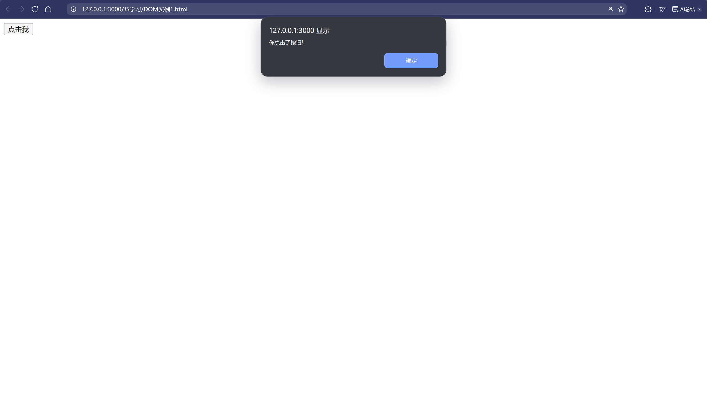
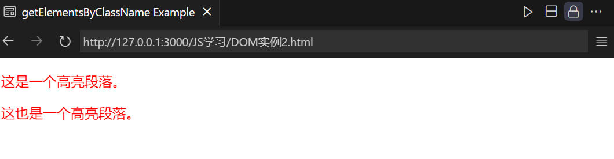
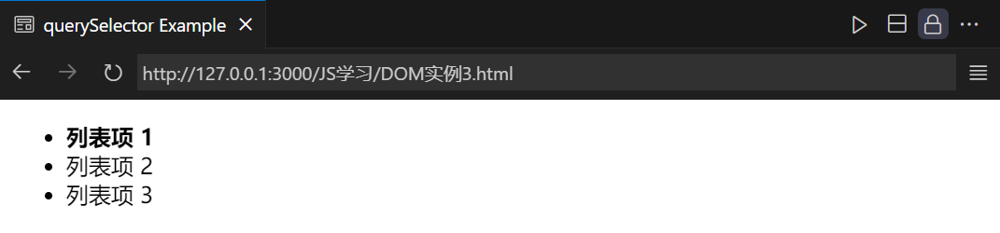
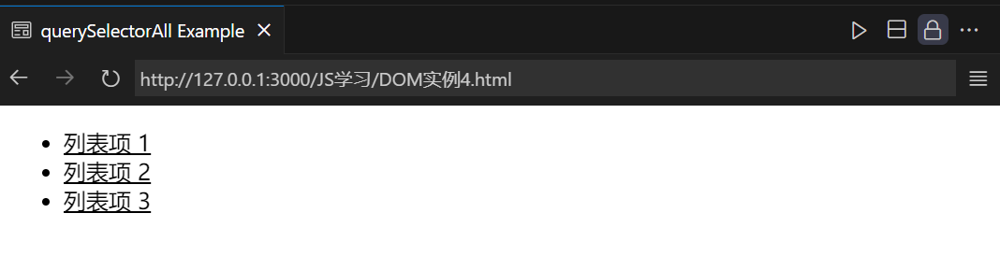
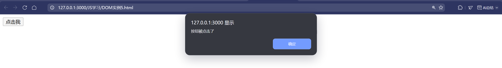
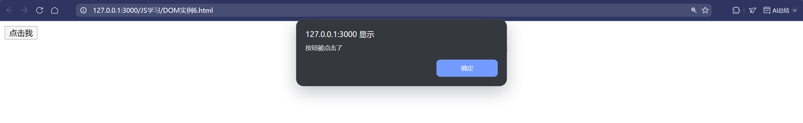
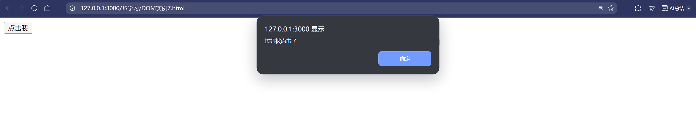

# JavaScript 深入学习笔记

## 一、JavaScript 与 HTML 的交互

### 1. 常见DOM [^1]操作

JavaScript 可以通过 DOM（文档对象模型）操作 HTML 元素。

#### `document.getElementById(id)`：通过元素的 ID 获取**元素**。

```html
<!DOCTYPE html>
<html lang="en">

<head>
    <meta charset="UTF-8">
    <meta name="viewport" content="width=device-width, initial-scale=1.0">
    <title>getElementById Example</title>
</head>

<body>
    <button id="myButton">点击我</button>
    <script>//点击按钮弹出提示框
        const button = document.getElementById('myButton');
        button.addEventListener('click', function () {
            alert('你点击了按钮！');
        });
    </script>
</body>

</html>
```


---

#### `document.getElementsByClassName(className)`：通过类名获取**元素集合**。

```html
<!DOCTYPE html>
<html lang="en">

<head>
    <meta charset="UTF-8">
    <meta name="viewport" content="width=device-width, initial-scale=1.0">
    <title>getElementsByClassName Example</title>
</head>

<body>
    <p class="highlight">这是一个高亮段落。</p>
    <p class="highlight">这也是一个高亮段落。</p>
    <script>
        const paragraphs = document.getElementsByClassName('highlight');
        for (let i = 0; i < paragraphs.length; i++) {
            paragraphs[i].style.color = 'red';
        }
    </script>
</body>

</html>
```


---

#### `document.querySelector(selector)`：使用 CSS 选择器获取**第一个匹配的元素**。

```html
<!DOCTYPE html>
<html lang="en">

<head>
    <meta charset="UTF-8">
    <meta name="viewport" content="width=device-width, initial-scale=1.0">
    <title>querySelector Example</title>
</head>

<body>
    <ul>
        <li>列表项 1</li>
        <li>列表项 2</li>
        <li>列表项 3</li>
    </ul>
    <script>
        const firstListItem = document.querySelector('ul li');
        firstListItem.style.fontWeight = 'bold';
    </script>
</body>

</html>
```

#### `document.querySelectorAll(selector)`：使用 CSS 选择器获取**所有匹配的元素集合**。

```html
<!DOCTYPE html>
<html lang="en">

<head>
    <meta charset="UTF-8">
    <meta name="viewport" content="width=device-width, initial-scale=1.0">
    <title>querySelectorAll Example</title>
</head>

<body>
    <ul>
        <li>列表项 1</li>
        <li>列表项 2</li>
        <li>列表项 3</li>
    </ul>
    <script>
        const listItems = document.querySelectorAll('ul li');
        listItems.forEach(function (item) {
            item.style.textDecoration = 'underline';
        });
    </script>
</body>

</html>
```




### 2. 事件处理

JavaScript 可以处理 HTML 元素的==事件==，如**点击、鼠标悬停、键盘输入等**。

### 点击事件

点击事件是 Web 开发中常用的交互方式，可通过多种方式实现。

#### 1. 在 HTML 标签中直接添加

可以直接在 HTML 元素的标签里使用 `onclick` 属性来指定点击事件触发的函数。

```html
<!DOCTYPE html>
<html lang="en">
<head>
    <meta charset="UTF-8">
    <meta name="viewport" content="width=device-width, initial-scale=1.0">
    <title>HTML 标签直接添加点击事件</title>
</head>
<body>
    <button onclick="showMessage()">点击我</button>
    <script>
        function showMessage() {
            alert('按钮被点击了');
        }
    </script>
</body>
</html>
```

在这个例子中，当按钮被点击时，`showMessage` 函数会被调用，弹出提示框。



#### 2. 通过 DOM 获取元素添加

使用 `document.getElementById` 等方法获取元素，然后设置其 `onclick` 属性为一个函数。

```html
<!DOCTYPE html>
<html lang="en">
<head>
    <meta charset="UTF-8">
    <meta name="viewport" content="width=device-width, initial-scale=1.0">
    <title>通过 DOM 获取元素添加点击事件</title>
</head>
<body>
    <button id="btn">点击我</button>
    <script>
        document.getElementById("btn").onclick = function() {
            alert('按钮被点击了');
        };
    </script>
</body>
</html>
```

这里通过 `document.getElementById` 获取按钮元素，接着将其 `onclick` 属性设为一个**匿名函数**，点击按钮时会弹出提示框。



#### 3. 使用事件监听方式添加

利用 `addEventListener` 方法为元素添加点击事件监听器。

```html
<!DOCTYPE html>
<html lang="en">
<head>
    <meta charset="UTF-8">
    <meta name="viewport" content="width=device-width, initial-scale=1.0">
    <title>使用事件监听方式添加点击事件</title>
</head>
<body>
    <button id="btn">点击我</button>
    <script>
        var el = document.getElementById("btn");
        el.addEventListener("click", function() {
            alert('按钮被点击了');
        }, false);
    </script>
</body>
</html>
```

在这个示例中，通过 `addEventListener` 方法为按钮添加了一个点击事件监听器，点击按钮时会弹出提示框。`addEventListener` 方法的第三个参数 `false` 表示使用冒泡阶段。

****

**==可以看到上述三种情况html代码呈现情况是一致的==，但本质上还是有些区别的：**

| 对比项               | 在 HTML 标签中直接添加 `onclick` 属性                        | 通过 DOM 获取元素添加 `onclick` 属性                         | 使用 `addEventListener` 方法添加事件监听器                   |
| -------------------- | ------------------------------------------------------------ | ------------------------------------------------------------ | ------------------------------------------------------------ |
| 语法和代码位置       | 将 JavaScript 代码直接写在 HTML 标签的 `onclick` 属性里，代码与 HTML **紧密耦合** | 先使用 `document.getElementById` 等方法获取 HTML 元素，然后为其`onclick` 属性**赋值一个函数**，代码通常写在 `<script>` 标签内 | 先获取 HTML 元素，再调用 `addEventListener` 方法添加**事件监听器**，代码写在 `<script>` 标签内 |
| 事件绑定数量         | **一个元素只能绑定一个 `onclick` 事件处理函数**，多次赋值时后面的<u>会覆盖</u>前面的 | **一个元素只能绑定一个 `onclick` 事件处理函数**，多次赋值时后面的<u>会覆盖</u>前面的 | **可以为同一个元素的同一个事件类型添加多个事件处理函数**，这些函数会按照添加的<u>顺序依次执行</u> |
| 事件流控制           | <u>无法对事件流（冒泡和捕获）进行控制，默认使用冒泡阶段</u>  | <u>无法对事件流（冒泡和捕获）进行控制，默认使用冒泡阶段</u>  | 可以通过第三个参数来控制事件是在冒泡阶段[^2]还是捕获阶段[^3]触发。当第三个参数为 `true` 时，事件在捕获阶段触发；为 `false` 或省略时，事件在冒泡阶段触发 |
| 代码可维护性和分离性 | HTML 和 JavaScript 代码混杂在一起，不利于代码的维护和管理，在大型项目中会使代码结构混乱 | HTML 和 JavaScript 代码分离，提高了代码的可维护性和可读性，方便后续开发和修改 | HTML 和 JavaScript 代码分离，提高了代码的可维护性和可读性，方便后续开发和修改 |

### 鼠标悬停事件

鼠标悬停事件能增强用户与页面元素的交互效果，有多种实现途径。

#### 1. 使用 HTML 的 onmouseover 属性

将函数直接绑定到 HTML 元素的 `onmouseover` 属性上，当鼠标悬停在该元素上时，相应的函数将被调用。

```html
<!DOCTYPE html>
<html lang="en">
<head>
    <meta charset="UTF-8">
    <meta name="viewport" content="width=device-width, initial-scale=1.0">
    <title>使用 HTML 的 onmouseover 属性</title>
</head>
<body>
    <button onmouseover="changeColor(this)">悬停触发函数</button>
    <script>
        function changeColor(element) {
            element.style.backgroundColor ='red';
        }
    </script>
</body>
</html>
```

此例中，当鼠标悬停在按钮上时，`changeColor` 函数会被调用，按钮背景颜色变为红色。

#### 2. 使用 JavaScript 的 addEventListener 方法

使用 `addEventListener` 方法来为 HTML 元素添加鼠标悬停事件的监听器。

```html
<!DOCTYPE html>
<html lang="en">
<head>
    <meta charset="UTF-8">
    <meta name="viewport" content="width=device-width, initial-scale=1.0">
    <title>使用 JavaScript 的 addEventListener 方法</title>
</head>
<body>
    <button id="myButton">悬停我</button>
    <script>
        function changeColor() {
            this.style.backgroundColor = 'green';
        }
        document.getElementById("myButton").addEventListener("mouseover", changeColor);
    </script>
</body>
</html>
```

这里通过 `addEventListener` 方法为按钮添加了鼠标悬停事件监听器，鼠标悬停时按钮背景颜色变为绿色。

#### 3. 使用 jQuery 的 hover 方法

如果使用了 jQuery 库，可以使用其 `hover` 方法来实现鼠标悬停事件的绑定。

```html
<!DOCTYPE html>
<html lang="en">
<head>
    <meta charset="UTF-8">
    <meta name="viewport" content="width=device-width, initial-scale=1.0">
    <title>使用 jQuery 的 hover 方法</title>
    <script src="https://code.jquery.com/jquery-3.6.0.min.js"></script>
</head>
<body>
    <button id="myButton">悬停我</button>
    <script>
        $("#myButton").hover(function() {
            $(this).css("background-color", "yellow");
        }, function() {
            $(this).css("background-color", "");
        });
    </script>
</body>
</html>
```

此示例中，当鼠标悬停在按钮上时，按钮背景颜色变为黄色，鼠标离开时恢复默认颜色。

### 键盘输入事件

键盘输入事件可捕捉用户在键盘上的操作，包含以下几种类型。

#### 1. keydown 事件

当按下键盘上的某个键时触发，并在按住该键时重复触发。可以通过 `event.keyCode` 或 `event.which` 获取按下键的编码信息。

```html
<!DOCTYPE html>
<html lang="en">
<head>
    <meta charset="UTF-8">
    <meta name="viewport" content="width=device-width, initial-scale=1.0">
    <title>keydown 事件</title>
</head>
<body>
    <input type="text" id="message">
    <script>
        let msg = document.getElementById('message');
        msg.addEventListener("keydown", (event) => {
            console.log('按下键的编码：', event.keyCode);
        });
    </script>
</body>
</html>
```

在这个例子中，当在文本框中按下键盘上的键时，会在控制台输出按下键的编码。

#### 2. keyup 事件

当释放键盘上的键时触发。同样可以通过 `event.keyCode` 等属性获取相关信息。

```html
<!DOCTYPE html>
<html lang="en">
<head>
    <meta charset="UTF-8">
    <meta name="viewport" content="width=device-width, initial-scale=1.0">
    <title>keyup 事件</title>
</head>
<body>
    <input type="text" id="message">
    <script>
        let msg = document.getElementById('message');
        msg.addEventListener("keyup", (event) => {
            console.log('释放键的编码：', event.keyCode);
        });
    </script>
</body>
</html>
```

此示例中，当在文本框中释放键盘上的键时，会在控制台输出释放键的编码。

#### 3. keypress 事件

当按下字符键盘（如 `a`、`b`、`c` 等）时触发，而不是方向键等控制键。不过在中文输入法下，有些浏览器可能不会触发此事件。可通过 `event.charCode`（非 IE 浏览器）或 `event.keyCode`（IE 浏览器）获取输入字符的编码。

```html
<!DOCTYPE html>
<html lang="en">
<head>
    <meta charset="UTF-8">
    <meta name="viewport" content="width=device-width, initial-scale=1.0">
    <title>keypress 事件</title>
</head>
<body>
    <input type="text" id="message">
    <script>
        let msg = document.getElementById('message');
        msg.addEventListener("keypress", (event) => {
            console.log('输入字符的编码：', event.charCode || event.keyCode);
        });
    </script>
</body>
</html>
```

这里当在文本框中按下字符键时，会在控制台输出输入字符的编码。


> [!TIP]
>
> ### 事件监听器和事件处理程序
>
> **事件监听器**和**事件处理程序**是用来<u>处理页面上各类事件的关键概念</u>
>
> #### **事件处理程序**
>
> 事件处理程序是一段在特定事件发生时执行的代码。可以把它看作是对事件做出**响应的函数**。事件处理程序能够直接绑定到 HTML 元素上，或者通过 JavaScript 动态添加。以下是事件处理程序的几种常见绑定方式：
>
> ##### **内联事件处理程序**
>
> 直接在 HTML 标签中使用事件属性（如 `onclick`、`onkeyup` 等）来指定事件处理程序。
>
> ```html
> <!DOCTYPE html>
> <html lang="en">
> 
> <body>
> <!-- 当按钮被点击时，会调用 alert 函数弹出警告框 -->
> <button onclick="alert('Button clicked!')">Click me</button>
> </body>
> 
> </html>
> ```
>
> 在这个例子中，`onclick` 属性的值是一个 JavaScript 代码片段，当按钮被点击时，该代码片段会被执行。
>
> **DOM0 级事件处理程序**
>
> 通过 JavaScript 代码将一个函数赋值给元素的事件属性。
>
> ```html
> <!DOCTYPE html>
> <html lang="en">
> 
> <body>
> <button id="myButton">Click me</button>
> <script>
>  // 获取按钮元素
>  const button = document.getElementById('myButton');
>  // 为按钮的 onclick 事件绑定一个函数
>  button.onclick = function () {
>    alert('Button clicked!');
>  };
> </script>
> </body>
> 
> </html>
> ```
>
> 在这个例子中，我们先获取了按钮元素，然后将一个匿名函数赋值给 `button` 的 `onclick` 属性，当按钮被点击时，该函数会被执行。
>
> #### **事件监听器**
>
> 事件监听器是一种更灵活、更强大的处理事件的方式。它允许你为一个元素的同一个事件绑定多个处理程序，并且可以控制事件的捕获和冒泡阶段。可以使用 `addEventListener` 方法来添加事件监听器。
>
> ```html
> <!DOCTYPE html>
> <html lang="en">
> 
> <body>
> <button id="myButton">Click me</button>
> <script>
>  // 获取按钮元素
>  const button = document.getElementById('myButton');
>  // 为按钮添加一个点击事件监听器
>  button.addEventListener('click', function () {
>    alert('Button clicked!');
>  });
>  // 为按钮添加另一个点击事件监听器
>  button.addEventListener('click', function () {
>    console.log('Button clicked again!');
>  });
> </script>
> </body>
> 
> </html>
> ```
>
> 在这个例子中，我们为按钮元素添加了两个点击事件监听器。当按钮被点击时，这两个事件处理程序都会按顺序执行。
>
> ### **事件监听器和事件处理程序的区别**
>
> - **灵活性**：事件监听器更为灵活，它可以为一个元素的同一个事件绑定多个处理程序，而事件处理程序（如 DOM0 级）同一时间只能绑定一个函数到事件属性上。
> - **事件阶段控制**：事件监听器可以通过第三个参数控制事件是在捕获阶段还是冒泡阶段触发，而事件处理程序只能在冒泡阶段触发。
> - **移除事件**：事件监听器可以使用 `removeEventListener` 方法移除，而事件处理程序（如内联事件处理程序）移除起来相对麻烦。
>
> 总之，事件处理程序是对事件做出响应的具体代码，而事件监听器是管理和触发这些处理程序的机制。在实际开发中，建议优先使用事件监听器，因为它提供了更多的灵活性和控制能力。


### 3. 表单验证

JavaScript 可以用于表单验证，确保用户输入符合要求。


```html
<form id="my-form">
    <input type="text" id="user-name" required>
    <input type="email" id="user-email" required>
    <button type="submit">Submit</button>
</form>
```

```javascript
let form = document.getElementById("my-form");
form.onsubmit = function(e) {
    e.preventDefault();
    let nameInput = document.getElementById("user-name");
    let emailInput = document.getElementById("user-email");

    if (nameInput.value.trim() === "") {
        alert("Please enter your name.");
    } else if (!isValidEmail(emailInput.value)) {
        alert("Please enter a valid email address.");
    } else {
        alert("Form submitted!");
    }
};

function isValidEmail(email) {
    // 简单的邮箱格式验证
    let emailPattern = /^[^\s@]+@[^\s@]+\.[^\s@]+$/;
    return emailPattern.test(email);
}
```

### 4. 动态创建元素

JavaScript 可以动态创建 HTML 元素并将其添加到页面中。


```javascript
let newList = document.createElement("ul");
newList.id = "dynamic-list";

for (let i = 1; i <= 5; i++) {
    let listItem = document.createElement("li");
    listItem.textContent = "Item " + i;
    newList.appendChild(listItem);
}

document.body.appendChild(newList);
```

## 二、JavaScript 与 CSS 的交互（常用）

### 1. 修改样式

JavaScript 可以动态修改 HTML 元素的样式。


```javascript
let heading = document.getElementById("main-heading");
heading.style.color = "blue";
heading.style.fontSize = "24px";
heading.style.transition = "all 0.3s ease";

// 使用样式表
let styleSheet = document.styleSheets[0];
styleSheet.insertRule(".highlight { animation: fadeIn 1s; }", styleSheet.cssRules.length);
```

### 2. 类操作

可以使用 `classList` 方法添加、移除或切换 CSS 类。


```javascript
heading.classList.add("highlight");
heading.classList.remove("highlight");
heading.classList.toggle("highlight");

// 检查类是否存在
if (heading.classList.contains("highlight")) {
    console.log("Element has the 'highlight' class");
}
```

### 3. 动画与过渡

结合 CSS 动画和 JavaScript，可以创建复杂的交互效果。


```css
@keyframes fadeIn {
    from { opacity: 0; }
    to { opacity: 1; }
}

.highlight {
    animation: fadeIn 1s;
}

@keyframes slideIn {
    from { transform: translateX(-100%); }
    to { transform: translateX(0); }
}

.slide-in {
    animation: slideIn 0.5s ease;
}
```


```javascript
button.onclick = function() {
    heading.classList.add("highlight");
    heading.classList.add("slide-in");
};

// 动画结束后移除类
heading.addEventListener("animationend", function() {
    heading.classList.remove("highlight");
    heading.classList.remove("slide-in");
});
```

### 4. 响应式设计

JavaScript 可以根据屏幕尺寸动态调整样式。


```javascript
function updateLayout() {
    if (window.innerWidth < 768) {
        document.body.style.layout = "single-column";
    } else {
        document.body.style.layout = "double-column";
    }
}

window.addEventListener("resize", updateLayout);
updateLayout();
```

## 三、实例练习

### 1. 创建一个简单的网页计数器

```html
<!DOCTYPE html>
<html lang="en">
<head>
    <!-- 设置文档的字符编码为UTF-8，确保能正确显示各种字符 -->
    <meta charset="UTF-8">
    <!-- 用于设置页面在不同设备上的显示方式，使页面宽度适应设备宽度，初始缩放比例为1.0 -->
    <meta name="viewport" content="width=device-width, initial-scale=1.0">
    <!-- 设置页面的标题为Simple Counter -->
    <title>Simple Counter</title>
    <style>
        /* 定义了一个名为counter的类选择器，设置字体大小为24px，文本居中对齐，外边距为20px */
       .counter {
            font-size: 24px;
            text-align: center;
            margin: 20px;
        }
        /* 定义了一个名为buttons的类选择器，设置为弹性盒模型布局，子元素水平居中排列，元素间间隔为10px */
       .buttons {
            display: flex;
            justify-content: center;
            gap: 10px;
        }
        /* 定义了button元素的样式，设置内边距、字体大小，并将鼠标指针样式设置为指针，提示可点击 */
        button {
            padding: 8px 16px;
            font-size: 16px;
            cursor: pointer;
        }
    </style>
</head>
<body>
    <!-- 这是一个用于显示计数器数值的div元素，类名为counter，id为counter，初始内容为0 -->
    <div class="counter" id="counter">0</div>
    <!-- 这是一个用于包含按钮的div元素，类名为buttons -->
    <div class="buttons">
        <!-- 这是一个用于减少计数器数值的按钮，id为decrement，显示文本为 - -->
        <button id="decrement">-</button>
        <!-- 这是一个用于增加计数器数值的按钮，id为increment，显示文本为 + -->
        <button id="increment">+</button>
    </div>

    <script>
        // 定义一个变量counter并初始化为0，用于存储计数器的当前值
        let counter = 0;
        // 通过id获取页面上的counter元素，并将其存储在counterElement变量中
        const counterElement = document.getElementById("counter");
        // 通过id获取页面上的decrement按钮元素，并将其存储在decrementButton变量中
        const decrementButton = document.getElementById("decrement");
        // 通过id获取页面上的increment按钮元素，并将其存储在incrementButton变量中
        const incrementButton = document.getElementById("increment");

        // 为decrementButton按钮添加点击事件监听器，当按钮被点击时，执行回调函数
        decrementButton.onclick = function() {
            // 将counter的值减1
            counter--;
            // 将counter的最新值设置为counterElement元素的文本内容，以更新页面显示
            counterElement.textContent = counter;
        };

        // 为incrementButton按钮添加点击事件监听器，当按钮被点击时，执行回调函数
        incrementButton.onclick = function() {
            // 将counter的值加1
            counter++;
            // 将counter的最新值设置为counterElement元素的文本内容，以更新页面显示
            counterElement.textContent = counter;
        };
    </script>
</body>
</html>
```

### 2. 创建一个待办事项列表

```html
<!DOCTYPE html>
<html lang="en">
<head>
    <!-- 设置文档的字符编码为 UTF-8，确保能正确显示各种字符 -->
    <meta charset="UTF-8">
    <!-- 用于设置页面在不同设备上的显示方式，使页面宽度适应设备宽度，初始缩放比例为 1.0 -->
    <meta name="viewport" content="width=device-width, initial-scale=1.0">
    <!-- 设置页面的标题为 To-Do List -->
    <title>To-Do List</title>
    <style>
        /* 定义待办事项容器的样式，设置最大宽度为 500px，上下外边距为 20px，水平居中，内边距为 20px，有灰色边框和圆角 */
       .todo-container {
            max-width: 500px;
            margin: 20px auto;
            padding: 20px;
            border: 1px solid #ccc;
            border-radius: 5px;
        }
        /* 定义待办事项输入框的样式，宽度为 100%，内边距为 8px，下外边距为 10px */
       .todo-input {
            width: 100%;
            padding: 8px;
            margin-bottom: 10px;
        }
        /* 定义单个待办事项的样式，内边距为 8px，下外边距为 8px，背景色为淡灰色，有圆角，使用弹性布局，子元素两端对齐且垂直居中 */
       .todo-item {
            padding: 8px;
            margin-bottom: 8px;
            background-color: #f9f9f9;
            border-radius: 3px;
            display: flex;
            justify-content: space-between;
            align-items: center;
        }
        /* 定义已完成待办事项的样式，添加删除线，文字颜色变灰 */
       .todo-item.completed {
            text-decoration: line-through;
            color: #888;
        }
        /* 定义待办事项操作按钮容器的样式，使用弹性布局，按钮间间隔为 5px */
       .todo-buttons {
            display: flex;
            gap: 5px;
        }
        /* 定义按钮的通用样式，内边距为 4px 8px，鼠标指针变为手型表示可点击 */
        button {
            padding: 4px 8px;
            cursor: pointer;
        }
    </style>
</head>
<body>
    <!-- 待办事项容器 -->
    <div class="todo-container">
        <!-- 待办事项列表标题 -->
        <h1>To-Do List</h1>
        <!-- 输入待办事项的输入框，使用 todo-input 类，设置占位符提示 -->
        <input type="text" class="todo-input" id="todo-input" placeholder="Enter a new task">
        <!-- 添加待办事项的按钮 -->
        <button id="add-todo">Add</button>
        <!-- 用于显示待办事项列表的容器 -->
        <div id="todo-list"></div>
    </div>

    <script>
        // 定义一个数组来存储所有的待办事项
        let todos = [];

        // 保存待办事项到本地存储的函数
        function saveTodos() {
            // 将 todos 数组转换为 JSON 字符串并存储到本地存储中，键名为 "todos"
            localStorage.setItem("todos", JSON.stringify(todos));
        }

        // 从本地存储加载待办事项的函数
        function loadTodos() {
            // 从本地存储中获取键名为 "todos" 的值
            const savedTodos = localStorage.getItem("todos");
            // 如果存在保存的待办事项
            if (savedTodos) {
                // 将 JSON 字符串解析为数组并赋值给 todos 变量
                todos = JSON.parse(savedTodos);
                // 调用 renderTodos 函数将待办事项渲染到页面上
                renderTodos();
            }
        }

        // 渲染待办事项到页面的函数
        function renderTodos() {
            // 获取待办事项列表的容器元素
            const todoListElement = document.getElementById("todo-list");
            // 清空待办事项列表容器中的内容
            todoListElement.innerHTML = "";
            // 遍历 todos 数组中的每个待办事项
            todos.forEach((todo, index) => {
                // 创建一个新的 div 元素用于表示单个待办事项
                const todoElement = document.createElement("div");
                // 根据待办事项是否完成添加相应的类名
                todoElement.className = `todo-item ${todo.completed ? "completed" : ""}`;
                // 设置待办事项元素的 HTML 内容，包含待办事项文本和操作按钮
                todoElement.innerHTML = `
                    <span>${todo.text}</span>
                    <div class="todo-buttons">
                        <button class="toggle-complete" data-index="${index}">${todo.completed ? "Undo" : "Complete"}</button>
                        <button class="delete" data-index="${index}">Delete</button>
                    </div>
                `;
                // 将单个待办事项元素添加到待办事项列表容器中
                todoListElement.appendChild(todoElement);
            });
        }

        // 为添加待办事项按钮添加点击事件监听器
        document.getElementById("add-todo").onclick = function() {
            // 获取待办事项输入框元素
            const todoInput = document.getElementById("todo-input");
            // 获取输入框中的文本内容并去除首尾空格
            const todoText = todoInput.value.trim();
            // 如果输入的文本不为空
            if (todoText !== "") {
                // 将新的待办事项对象添加到 todos 数组中
                todos.push({ text: todoText, completed: false });
                // 保存更新后的待办事项数组到本地存储
                saveTodos();
                // 重新渲染待办事项列表
                renderTodos();
                // 清空输入框中的内容
                todoInput.value = "";
            }
        };

        // 为待办事项输入框添加按键按下事件监听器
        document.getElementById("todo-input").onkeypress = function(e) {
            // 如果按下的键是回车键
            if (e.key === "Enter") {
                // 模拟点击添加待办事项按钮
                document.getElementById("add-todo").click();
            }
        };

        // 为待办事项列表容器添加点击事件监听器，使用事件委托处理子元素的点击事件
        document.getElementById("todo-list").addEventListener("click", function(e) {
            // 如果点击的是切换完成状态的按钮
            if (e.target.classList.contains("toggle-complete")) {
                // 获取按钮的 data-index 属性值并转换为整数，作为待办事项在数组中的索引
                const index = parseInt(e.target.getAttribute("data-index"));
                // 切换该待办事项的完成状态
                todos[index].completed = !todos[index].completed;
                // 保存更新后的待办事项数组到本地存储
                saveTodos();
                // 重新渲染待办事项列表
                renderTodos();
            } 
            // 如果点击的是删除按钮
            else if (e.target.classList.contains("delete")) {
                // 获取按钮的 data-index 属性值并转换为整数，作为待办事项在数组中的索引
                const index = parseInt(e.target.getAttribute("data-index"));
                // 从 todos 数组中删除该待办事项
                todos.splice(index, 1);
                // 保存更新后的待办事项数组到本地存储
                saveTodos();
                // 重新渲染待办事项列表
                renderTodos();
            }
        });

        // 页面加载时调用 loadTodos 函数从本地存储加载待办事项
        loadTodos();
    </script>
</body>
</html>
```


## *注释

[^1]:“DOM” 即文档对象模型（Document Object Model）。它是一种用于 HTML 和 XML 文档的**编程接口**，<u>将网页文档表示为一个由节点组成的树形结构</u>。通过 DOM，可以使用编程语言（如 JavaScript）来<u>访问和操作</u>网页中的各个元素，如修改文本内容、改变样式、添加或删除节点等。DOM 提供了一种标准化的方法来处理网页文档，使得开发者能够更方便地与网页进行交互和动态更新。
[^2]:冒泡阶段是指事件从具体的<u>目标元素</u>开始**向上传播**，依次经过其祖先元素，就像水中的气泡从底部往上升一样。例如，在一个嵌套的 HTML 元素结构中，当内部元素上发生一个点击事件时，这个事件会先在内部元素上触发，然后依次向上在其父元素、祖父元素等上触发，**直到到达文档的根元素**。
[^3]:捕获阶段则是事件从最外层的<u>祖先元素</u>开始**向下传播**，直到到达具体的目标元素。在这个过程中，事件先在祖先元素上触发，**然后逐渐向目标元素靠近**。
