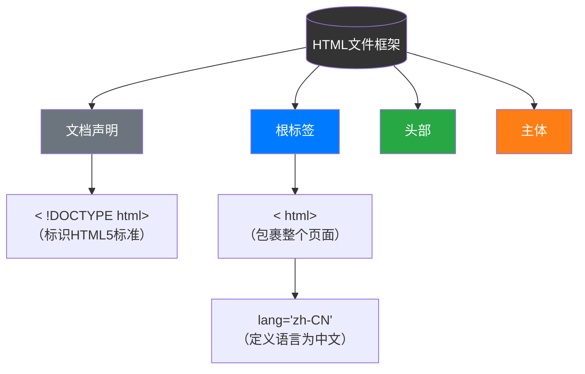
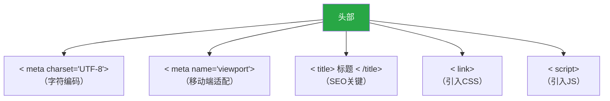
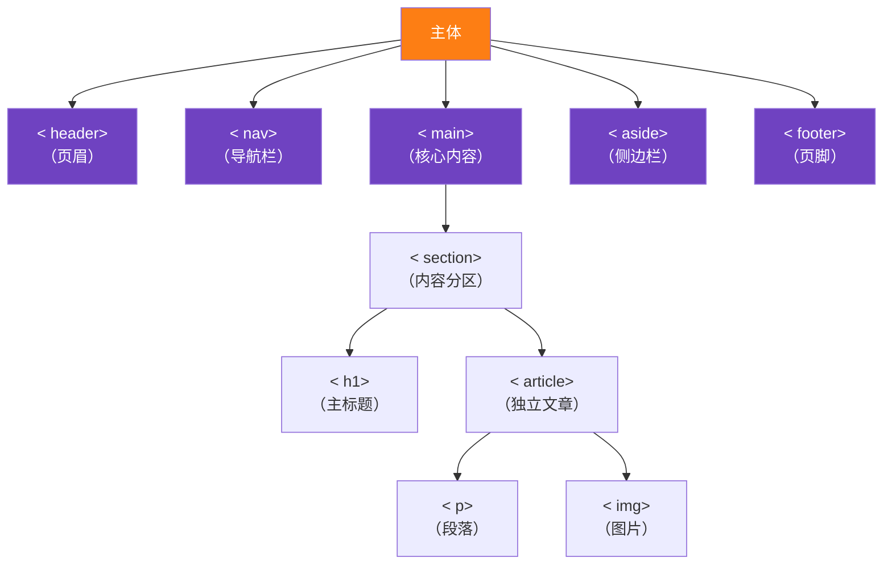
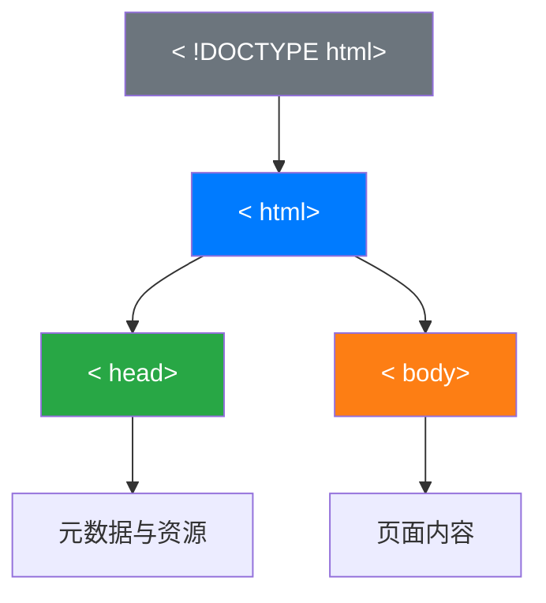
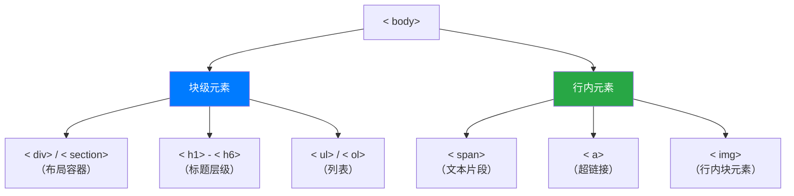

**HTML程序基本框架：**

```html
<!DOCTYPE html> <!-- 声明文档类型为 HTML5 -->
<html lang="zh-CN"> <!-- 定义 HTML 文档，语言设置为中文 -->
<head> <!-- 文档头部，用于存放元数据、页面标题、样式和脚本等信息 -->
    <meta charset="UTF-8"> <!-- 设置字符编码为 UTF-8，确保页面能正确显示各种字符 -->
    <meta name="viewport" content="width=device-width, initial-scale=1.0"> <!-- 配置视口，实现响应式布局 -->
    <title>页面标题</title> <!-- 设定浏览器标签页显示的页面标题 -->
    <link rel="stylesheet" href="styles.css"> <!-- 引入外部样式表 styles.css -->
    <style> /* 内联样式，可直接在 HTML 文件中定义样式 */       
        body {…}
        header {…}
        nav ul {…}
        nav ul li {…}
        main {…}
        footer {…}
    </style>
    <script>
        // 内联脚本，在页面加载完成后触发事件
        document.addEventListener('DOMContentLoaded', function() {
            console.log('页面加载完成'); // 页面加载完成后在控制台输出提示信息
        });
    </script>
</head>
<body> <!-- 文档主体，包含页面的可见内容 -->
    <header> <!-- 页面头部，通常包含网站标题和导航栏 -->
        <h1>网站标题</h1> <!-- 一级标题，代表网站的主要标题 -->
        <nav> <!-- 导航栏，用于放置网站的导航链接 -->
            <ul> <!-- 无序列表，用于组织导航链接 -->
                <li><a href="#home">首页</a></li> <!-- 列表项，包含指向首页的链接 -->
                <li><a href="#about">关于</a></li> <!-- 列表项，包含指向关于页面的链接 -->
                <li><a href="#services">服务</a></li> <!-- 列表项，包含指向服务页面的链接 -->
                <li><a href="#contact">联系</a></li> <!-- 列表项，包含指向联系页面的链接 -->
            </ul>
        </nav>
    </header>
    <main> <!-- 主要内容区域，包含页面的核心信息 -->
        <article> <!-- 文章内容，通常是独立的、完整的内容块 -->
            <h2>文章标题</h2> <!-- 二级标题，代表文章的标题 -->
            <p>这是一个段落内容。HTML标签的层级结构可以帮助我们更好地组织页面内容。</p> <!-- 段落标签，用于显示一段文本内容 -->
            <section> <!-- 章节内容，用于将文章划分为不同部分 -->
                <h3>章节标题</h3> <!-- 三级标题，代表章节的标题 -->
                <p>这是章节内容。使用语义化标签可以提高页面的可读性和SEO效果。</p> <!-- 段落标签，显示章节的文本内容 -->
                 <!-- 图片标签，用于显示图片，src 为图片路径，alt 为图片替代文本 -->
                <figure> <!-- 图片容器，用于包含图片及其说明 -->
                    <figcaption>图片说明</figcaption> <!-- 图片说明标签，为图片提供文字描述 -->
                </figure>
            </section>
            <section> <!-- 另一个章节内容 -->
                <h3>另一个章节标题</h3> <!-- 三级标题，代表另一个章节的标题 -->
                <p>这是另一个章节内容。</p> <!-- 段落标签，显示另一个章节的文本内容 -->
                <ul> <!-- 无序列表，用于组织相关的列表项 -->
                    <li>列表项 1</li> <!-- 列表项，显示列表中的一项内容 -->
                    <li>列表项 2</li> <!-- 列表项，显示列表中的一项内容 -->
                    <li>列表项 3</li> <!-- 列表项，显示列表中的一项内容 -->
                </ul>
            </section>
        </article>
        <aside> <!-- 侧边栏，通常用于显示次要信息或相关链接 -->
            <h3>侧边栏</h3> <!-- 三级标题，代表侧边栏的标题 -->
            <p>这是侧边栏内容，通常用于显示次要信息或相关链接。</p> <!-- 段落标签，显示侧边栏的文本内容 -->
        </aside>
    </main>
    <footer> <!-- 页脚，通常包含版权信息等 -->
        <p>&copy; 2025 网站名称. 保留所有权利。</p> <!-- 段落标签，显示版权信息 -->
    </footer>
    <script src="script.js"></script> <!-- 引入外部 JavaScript 文件 -->
</body>
</html>
```








**1. 文件结构关系**


**2. 内容嵌套规则**



