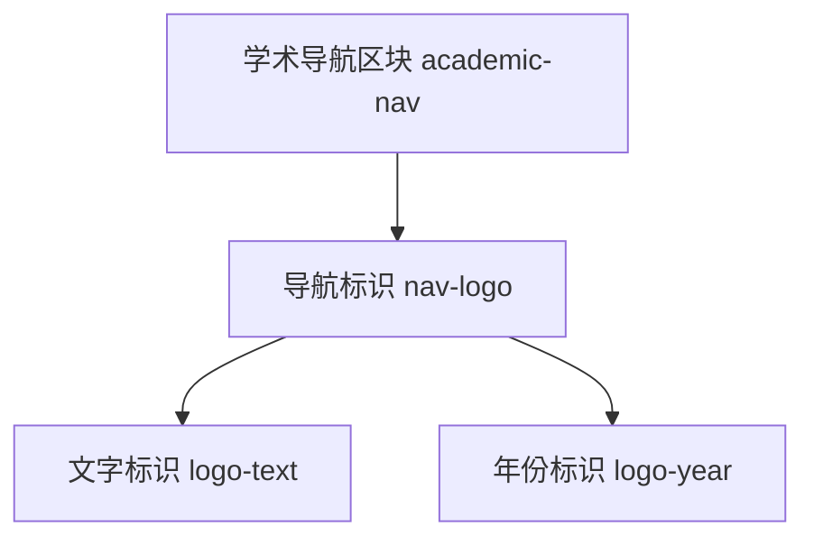
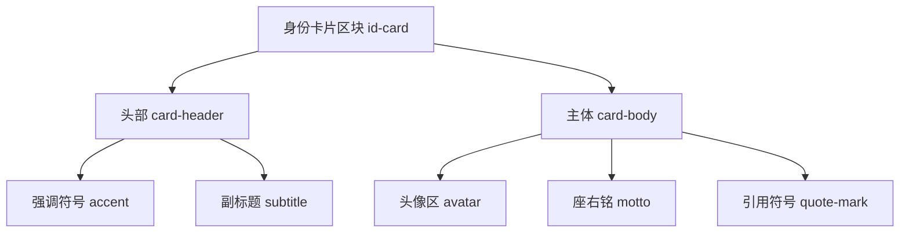
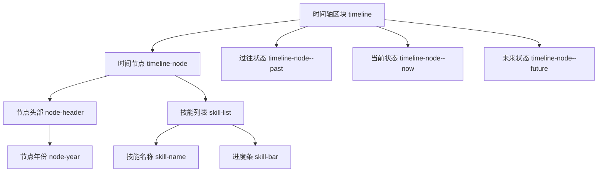
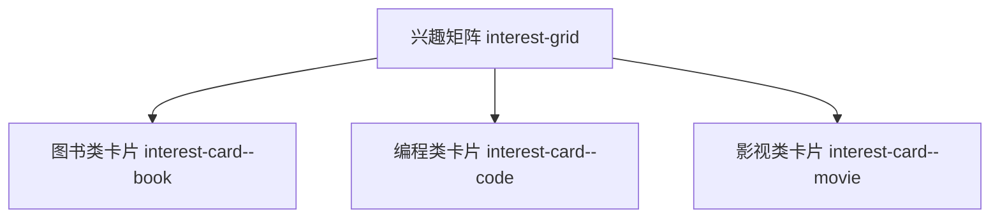
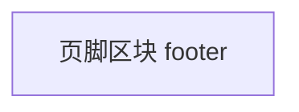

## BEM命名规范

BEM（Block Element Modifier）是一种前端开发中广泛使用的 CSS 命名规范，旨在通过清晰的命名结构提高代码可维护性和团队协作效率。以下是 BEM 的详细说明：

------

### **核心概念**

BEM 将界面拆解为三个层级：

1. **Block（块）**：独立的可复用组件（如 `header`, `menu`, `button`）
2. **Element（元素）**：块的组成部分，不能脱离块存在（如 `menu-item`, `button__icon`）
3. **Modifier（修饰符）**：定义块或元素的状态或样式变化（如 `button--disabled`, `menu--dark`）

------

### **命名规则**

#### 1. **Block（块）**

- 命名语义化（如 `.search-form`）
- **不依赖父级元素**，可独立使用
- 示例：`.nav`, `.card`, `.modal`

#### 2. **Element（元素）**

- 格式：`block__element`

- 使用 **双下划线** 连接块与元素

- 元素**必须属于块**，不可单独使用

- 示例：

  ```
  .search-form__input  /* 块的输入框 */
  .card__title         /* 卡片的标题 */
  ```

#### 3. **Modifier（修饰符）**

- 格式：`block--modifier` 或 `block__element--modifier`

- 使用 **双连字符** 表示修饰符

- 描述**状态**或**样式变化**（如大小、颜色、禁用状态）

- 示例：

  ```
  .button--primary    /* 主要按钮样式 */
  .menu__item--active /* 菜单激活项 */
  ```

------

### **关键原则**

1. **扁平结构**
   - 避免嵌套选择器（如 `.block .block__element`）
   - 直接通过类名定位元素（如 `.block__element`）
2. **独立作用域**
   - 块和元素的样式仅作用于自身，不影响其他组件。
3. **禁止元素嵌套**
   - 元素不能作为其他元素的子元素（错误示例：`.block__element1__element2`）。
4. **修饰符独立**
   - 修饰符需与块或元素类名**同时使用**（如 `<div class="button button--large">`）。

------

### **代码示例**

```HTML
<!-- Block: 搜索表单 -->
<form class="search-form">
  <!-- Element: 输入框 -->
  <input class="search-form__input" type="text">
  
  <!-- Element + Modifier: 禁用状态的按钮 -->
  <button class="search-form__button search-form__button--disabled">Search</button>
</form>

<!-- Block + Modifier: 深色导航栏 -->
<nav class="nav nav--dark">
  <!-- Element: 导航项 -->
  <a class="nav__item nav__item--active">Home</a>
</nav>
```

------

### **优势**

- **高可读性**：通过类名即可理解组件结构。
- **低耦合性**：避免样式冲突，便于复用。
- **易维护性**：修改组件时不影响其他部分。

------

### **常见问题**

1. **类名过长？**
   可通过 CSS 预处理器（如 Sass[^1]）简化：

   ```
   .search-form {
     &__input { ... }
     &__button {
       &--disabled { ... }
     }
   }
   ```

2. **BEM 是否适用于现代框架？**
   完全适用，且可与 CSS Modules、Styled Components 等结合使用。

3. **何时不用 BEM？**

   - 小型项目或简单页面可能过度设计。
   - 需搭配其他规范（如 Atomic CSS）灵活使用。

------

### **总结**

**BEM 通过严格的命名约定，将 CSS 结构转化为可预测的代码模式，尤其适合中大型项目与团队协作。掌握其核心原则后，可显著提升前端代码质量。**


## 个人网页设计实践尝试

### 一、BEM命名框架

#### 1、区块命名规范（-单短杠/无）：

academic-nav（学术导航栏）

id-card（身份卡片）

timeline（时间轴）

interest-grid（兴趣矩阵）

footer（页脚）

#### 2、元素命名规范（__双下划线）：

nav-logo__text
card-header__title
skill-list__item

#### 3、修饰符命名规范（--双短杠）：

timeline-node--past
interest-card--book
skill-bar--90percent

### 二、层级结构表


- **academic-nav（导航栏区块）**
  - **nav-logo（导航标识）**
    - logo-text（文字标识）
    - logo-year（年份标识）

- **id-card（身份卡片区块）**
  - **card-header（头部）**
    - accent（强调符号）
    - subtitle（副标题）
  - **card-body（主体）**
    - avatar（头像区）
    - motto（座右铭）
    - quote-mark（引用符号）

- **timeline（时间轴区块）**
  - **timeline-node（时间节点）**
    - **node-header（节点头部）**
      - node-year（节点年份）
    - **skill-list（技能列表）**
      - skill-name（技能名称）
      - skill-bar（进度条）
  - timeline-node--past（过往状态）
  - timeline-node--now（当前状态）
  - timeline-node--future（未来状态）

- **interest-grid（兴趣矩阵）**
  - interest-card--book（图书类卡片）
  - interest-card--code（编程类卡片）
  - interest-card--movie（影视类卡片）

- **footer（页脚区块）**



<br>


<br>


<br>


<br>




## *注释

[^1]:Sass 是一种 CSS 预处理器，它扩展了 CSS 语言，增加了诸如变量、嵌套规则、混合（mixin）、继承等功能，使 CSS 的编写更加高效和可维护。它允许开发者以更结构化和模块化的方式编写样式表，然后将 Sass 代码编译成标准的 CSS 代码以供浏览器使用。
